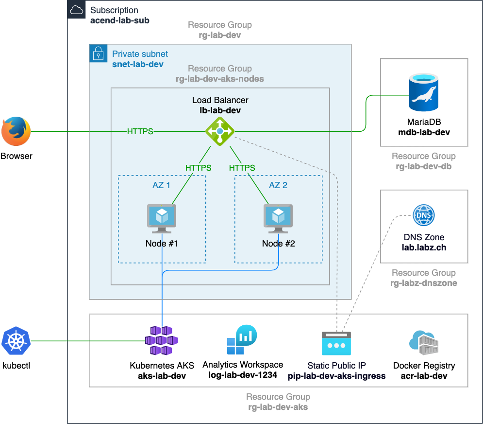

We will learn how to configure the Azure provider and provision resources in a subscription.


# Solution Architecture

**Goal:** Deploy a HTTPS application on Kubernetes which writes to a database

Main components:
- Kubernetes Cluster (AKS, Azure Kubernetes Service)
- Log Analytics Workspace
- Docker container registry (ACR)
- Virtual Network (Vnet) + Subnet
- Static IP + DNS A record
- Load balancer (Layer 4) + Kubernetes Ingress Controller (NGINX)
- SSL Cert Manager
- MariaDB 





# Preparation

Let's start with the creation of a subfolder for all **azure** exercises:

```bash
mkdir azure
cd azure
```

If you don't have `az` CLI installed yet, navgiate to https://docs.microsoft.com/en-us/cli/azure/install-azure-cli
and follow the instructions.

After installation, run
```bash
az login
```
and follow the console and web browser instructions.

The Azure naming convention and resource abbreviation can be found at 
https://docs.microsoft.com/en-us/azure/cloud-adoption-framework/ready/azure-best-practices/resource-abbreviations
