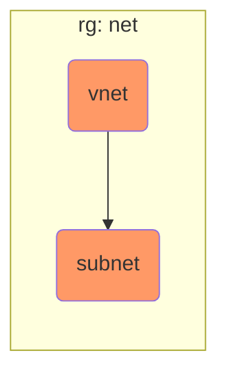
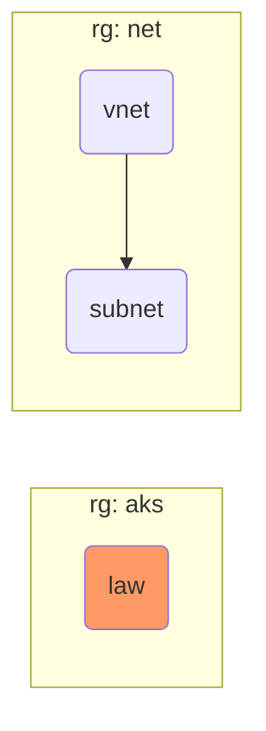
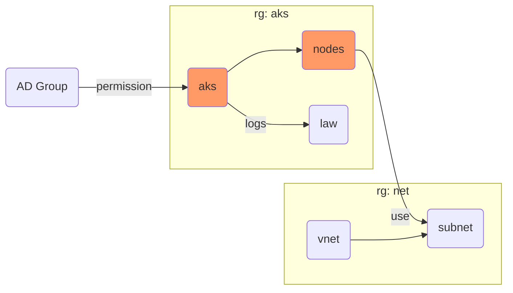
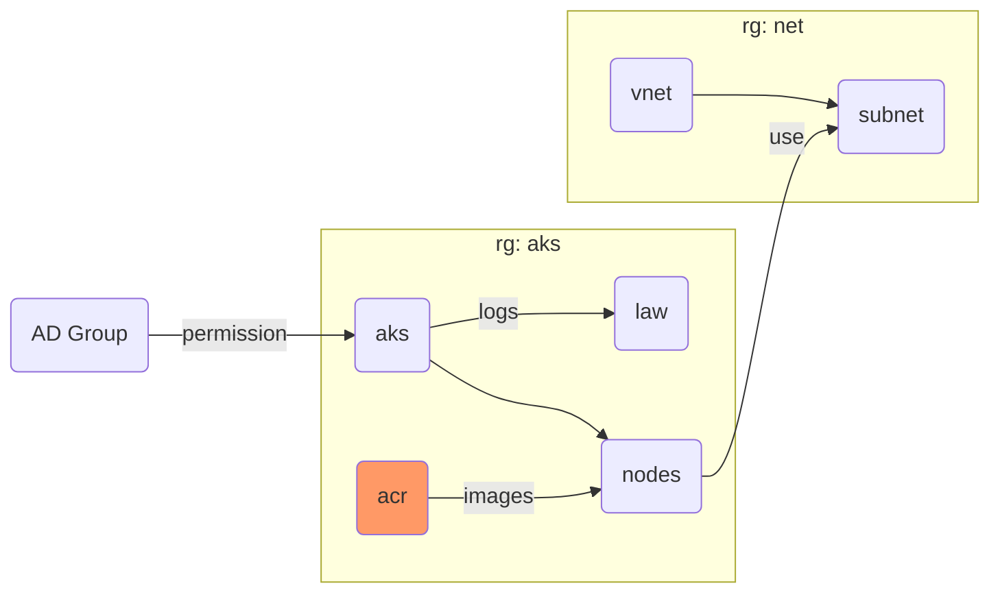

## Step {}.1: Provision the first resource

Create a new file named `main.tf` and add the following content:
```terraform
provider "azurerm" {
  subscription_id = var.subscription_id
  features {
    resource_group {
      prevent_deletion_if_contains_resources = false
    }
  }
}

resource "azurerm_resource_group" "default" {
  name     = "rg-${local.infix}"
  location = var.location
}

data "azurerm_subscription" "current" {}
```

Create a new file named `variables.tf` and add the following content:
```terraform
locals {
  infix = "${var.purpose}-${var.environment}"
}

variable "subscription_id" {}
variable "purpose" {}
variable "environment" {}
variable "location" {}
```

Create a new configuration file file named `config/dev.tfvars` and add the following content:
```terraform
subscription_id = "c1b34118-6a8f-4348-88c2-b0b1f7350f04"
purpose         = "YOUR_USERNAME"
environment     = "dev"
location        = "westeurope"
```

**Note**: Please replace `YOUR_USERNAME` with the username assigned to you for this workshop.

As seen earlier, its good practice to lock the Terraform CLI and provider versions
to avoid uncontrolled version upgrades.

Create a new file named `versions.tf` and add the following content:
```terraform
terraform {
  required_version = "> 1.12.0"

  required_providers {
    azurerm = {
      source  = "hashicorp/azurerm"
      version = "=4.46.0"
    }
  }
}
```

{}
As of this writing, the current version is `1.11.2`. Set the versions to the latest on by using `terraform version`
{}

Now run
```bash
terraform init
terraform apply -var-file=config/dev.tfvars
```

You can now navigate to the Azure Portal in your browser and see the newly created resource group with
the name `rg-YOUR_USERNAME-dev` at
https://portal.azure.com/#@acend.onmicrosoft.com/resource/subscriptions/c1b34118-6a8f-4348-88c2-b0b1f7350f04/resourceGroups


### Explanation

The `provider` block configures the Azure provider to use a specific subscription id, provided via configuration file.
This structure allows provisioning of the same infrastructure in different subscriptions using different configuration
files.

The `location` argument defines in which Azure region the resources shall be deployed. We choose `westeurope` which is
the Netherlands because it is amongst the cheapest regions in Europe.


## Step {}.2: Add a virtual network and subnet



Create a new file named `network.tf` and add the following content:
```terraform
resource "azurerm_virtual_network" "default" {
  name                = "vnet-${local.infix}"
  location            = azurerm_resource_group.default.location
  resource_group_name = azurerm_resource_group.default.name
  address_space       = [var.network_cidrs.vnet]
}

// There can only be one Network Watcher per subscription; uncomment the following block
// for your own Azure subscriptions outside the lab
//resource "azurerm_network_watcher" "default" {
//  name                = "nw-${local.infix}"
//  location            = azurerm_resource_group.default.location
//  resource_group_name = azurerm_resource_group.default.name
//}

resource "azurerm_subnet" "private" {
  name                 = "snet-${local.infix}-private"
  resource_group_name  = azurerm_virtual_network.default.resource_group_name
  virtual_network_name = azurerm_virtual_network.default.name
  address_prefixes     = [var.network_cidrs.subnet]
}
```

Append the following content to the end of `variables.tf`:
```terraform
variable "network_cidrs" {
  default = {
    vnet    = "10.0.0.0/8"
    subnet  = "10.1.0.0/16"
  }
  type = object({
    vnet    = string
    subnet  = string
  })
}
```

Now run
```bash
terraform apply -var-file=config/dev.tfvars
```


### Explanation

A resource of type `azurerm_network_watcher` is automatically created by Azure for each VNet if not explicitly created.
We prefer to provision it via Terraform and align the resource name with our naming convention.

The new variable `network_cidrs` keeps the code DRY by moving values to variables. Since it is unlikely to
change, we set a default.

The optional `type` identifier or the variable enforces a specific structure, preventing incomplete configuration.


## Step {}.3: Add an Analytics Workspace



We add an Analytics Workspace to capture the Kubernetes logs and metrics.

Create a new file named `aks.tf` and add the following content:
```terraform
resource "azurerm_resource_group" "aks" {
  location = var.location
  name     = "rg-${local.infix}-aks"
}
```

Create a new file named `analytics_workspace.tf` and add the following content:
```terraform
resource "random_string" "log_analytics_workspace" {
  length  = 4
  special = false
  upper   = false
}

resource "azurerm_log_analytics_workspace" "aks" {
  name                = "log-${local.infix}-${random_string.log_analytics_workspace.result}"
  location            = var.location
  resource_group_name = azurerm_resource_group.aks.name
  sku                 = "PerGB2018"
}
```

We added a resource requiring the random provider, run init again:
```bash
terraform init
terraform apply -var-file=config/dev.tfvars
```


### Explanation

The workspace requires a global unique name. To achieve this, we add a random generated 4-digit number to the
workspace name.


## Step {}.4: Add the Kubernetes cluster (AKS)



Create a new file named `iam.tf` and add the following content:
```terraform
data "azuread_group" "aks_admins" {
  display_name = var.aks.ad_admin_group
}

resource "azurerm_role_assignment" "students" {
  scope                = azurerm_kubernetes_cluster.aks.id
  role_definition_name = "Azure Kubernetes Service RBAC Cluster Admin"
  principal_id         = data.azuread_group.aks_admins.object_id
}
```

Add the following content to the end of `aks.tf`:
```terraform
resource "azurerm_kubernetes_cluster" "aks" {
  name                = "aks-${local.infix}"
  location            = var.location
  resource_group_name = azurerm_resource_group.aks.name
  node_resource_group = "${azurerm_resource_group.aks.name}-nodes"
  dns_prefix          = local.infix
  kubernetes_version  = var.aks.kubernetes_version
  oidc_issuer_enabled = true
  workload_identity_enabled = true

  default_node_pool {
    name               = "linux"
    type               = "VirtualMachineScaleSets"
    vnet_subnet_id     = azurerm_subnet.private.id
    vm_size            = var.aks.node_pool.vm_size
    node_count         = var.aks.node_pool.node_count

    upgrade_settings {
      drain_timeout_in_minutes      = 0
      max_surge                     = "10%"
      node_soak_duration_in_minutes = 0
    }
  }

  network_profile {
    network_plugin    = "kubenet"
    load_balancer_sku = "standard"
  }

  identity {
    type = "SystemAssigned"
  }

  role_based_access_control_enabled = true
  azure_active_directory_role_based_access_control {
    tenant_id          = data.azurerm_subscription.current.tenant_id
    azure_rbac_enabled = true
  }
}

resource "azurerm_role_assignment" "aks_identity_networking" {
  scope                = data.azurerm_subscription.current.id
  role_definition_name = "Network Contributor"
  principal_id         = azurerm_kubernetes_cluster.aks.identity[0].principal_id
}
```

Add the following content to the end of `variables.tf`:
```terraform
variable "aks" {
  type = object({
    kubernetes_version    = string
    log_retention_in_days = number
    ad_admin_group        = string
    node_pool = object({
      vm_size    = string
      node_count = number
    })
  })
}
```

Add the following content to the end of `config/dev.tfvars` (check the latest kubernetes version and use it as input):
```terraform
aks = {
  // az aks get-versions --location westeurope -o table
  kubernetes_version    = "1.34.1"
  log_retention_in_days = 30
  ad_admin_group        = "students"
  node_pool = {
    node_count = 2
    vm_size    = "Standard_B2ms"
  }
}
```

Now run
```bash
terraform apply -var-file=config/dev.tfvars
```


### Explanation

We provision an AKS cluster with two nodes of type `Standard_B2ms` in different availability zones.
The available Kubernetes versions on Azure can be listed by running:
```bash
az aks get-versions --location westeurope -o table
```

The `identity` (service principal) is managed by Azure and the monitoring agent `oms_agent` is configured to
use the newly created analytics workspace.

The `azurerm_role_assignment` resources grant roles to the AKS identity;

* `Monitoring Metrics Publisher` allows AKS to publish to the analytics workspace
* `Network Contributor` allows AKS to provision a layer 4 load balancer


## Step {}.5: Add a Docker registry (ACR)



Create a new file named `acr.tf` and add the following content:
```terraform
resource "random_integer" "acr" {
  min = 1000
  max = 9999
}

resource "azurerm_container_registry" "aks" {
  name                = "cr${replace(local.infix, "-", "")}${random_integer.acr.result}"
  location            = var.location
  resource_group_name = azurerm_resource_group.aks.name
  admin_enabled       = true
  sku                 = "Basic"
}
```

Add the following content to the end of `aks.tf`:
```terraform
resource "azurerm_role_assignment" "aks_identity_acr" {
  scope                = azurerm_container_registry.aks.id
  role_definition_name = "AcrPull"
  principal_id         = azurerm_kubernetes_cluster.aks.kubelet_identity.0.object_id
}
```

Now run
```bash
terraform init
terraform apply -var-file=config/dev.tfvars
```


### Explanation

Similar to the analytics workspace, the Docker container registry has to have a global unique name and cannot
contain non-alphanumeric characters; hence `-` are not allowed. We append a random 4-digit number to the ACR name.

We grant the AKS identity the `AcrPull` role to allow AKS to pull Docker images from the registry without
providing explicit credentials.
