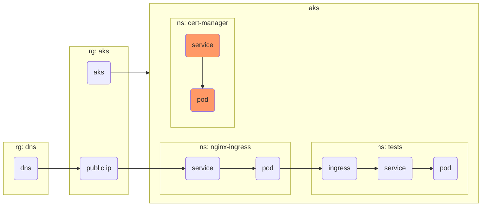
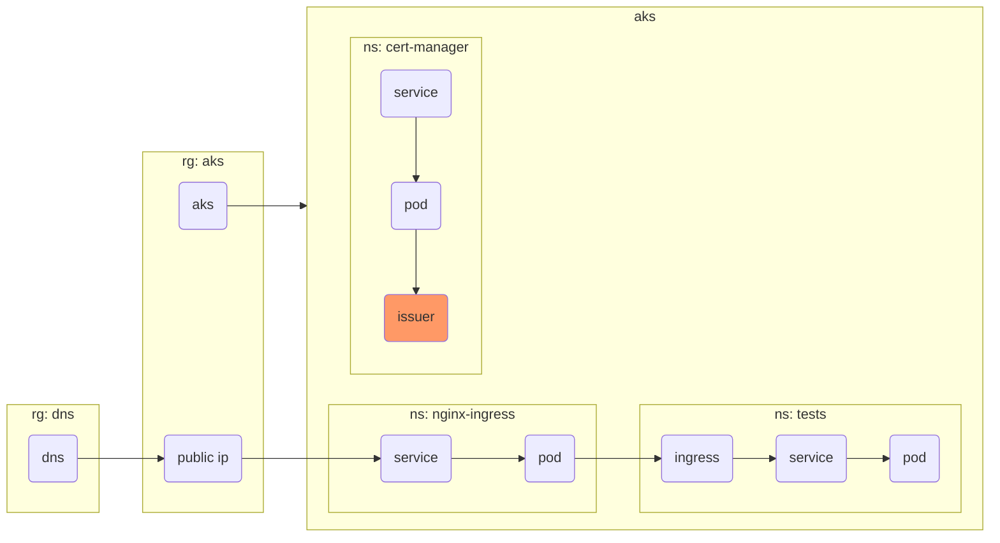

## Step {}.1: Cert Manager installation



Create a new file named `cert_manager.tf` and add the following content:
```terraform
resource "kubernetes_namespace" "cert_manager" {
  metadata {
    name = "cert-manager"
  }
}

resource "helm_release" "cert_manager" {
  name         = "cert-manager"
  repository   = "https://charts.jetstack.io"
  chart        = "cert-manager"
  version      = "1.18.2"
  namespace    = kubernetes_namespace.cert_manager.id
  atomic       = true
  reset_values = true

  set = [
    {
      name  = "installCRDs"
      value = "true"
    },
    {
      name  = "global.leaderElection.namespace"
      value = kubernetes_namespace.cert_manager.id
    },
    {
        name = "dns01RecursiveNameservers"
        value = "9.9.9.10:53"
    }
  ]
  depends_on = [ azurerm_kubernetes_cluster.aks ]
}
```

Now run
```bash
terraform apply -var-file=config/dev.tfvars
```


## Step {}.2: Cluster Issuer



Create a new directory structure:
```bash
mkdir -p helm/cert_manager_issuer/templates
```

Create a new file named `helm/cert_manager_issuer/Chart.yaml` and add the following content:
```yaml
apiVersion: v2
name: cluster-issuers
description: Let's Encrypt cluster issuer for Cert Manager
version: 1.0.0
```

Create a new file named `helm/cert_manager_issuer/templates/cluster_issuer.yaml` and add the following content:
```yaml
# https://cert-manager.io/docs/configuration/acme/dns01/azuredns/
apiVersion: cert-manager.io/v1
kind: ClusterIssuer
metadata:
  name: letsencrypt-prod
spec:
  acme:
    server: https://acme-v02.api.letsencrypt.org/directory
    email: noreply@labz.ch
    privateKeySecretRef:
      name: letsencrypt-prod
    solvers:
    - http01:
        ingress:
          class: nginx
```

Add the following content to the end of `cert_manager.tf`:
```terraform
resource "helm_release" "cluster_issuer" {
  name         = "cluster-issuer"
  chart        = "${path.module}/helm/cert_manager_issuer"
  version      = "1.0.0"
  namespace    = kubernetes_namespace.cert_manager.metadata.0.name
  atomic       = true
  reset_values = true

  depends_on = [helm_release.cert_manager]
}
```

Now run
```bash
terraform apply -var-file=config/dev.tfvars
```


### Explanation

Cert Manager needs to be configured with a `ClusterIssuer` Kubernetes resource.
This uses a Kubernetes CRD (Custom Resource Definition), which we deploy using a custom Helm chart.

The resource `helm_release.cluster_issuer` depends on `helm_release.cert_manager` because it deploys a CRD which
is registered by the Cert Manager, triggering a Kubernetes verification error (API unknown).


## Step {}.3: Test HTTPS ingress

Create a new file named `tests/https.yaml` and add the following content:
```yaml
apiVersion: networking.k8s.io/v1
kind: Ingress
metadata:
  name: secure
  namespace: tests
  annotations:
    nginx.ingress.kubernetes.io/ssl-redirect: "true"
    cert-manager.io/cluster-issuer: letsencrypt-prod
spec:
  ingressClassName: nginx
  tls:
  - hosts:
    - secure.YOUR_USERNAME.labz.ch
    secretName: tls-secure
  rules:
  - host: secure.YOUR_USERNAME.labz.ch
    http:
      paths:
      - path: /
        pathType: Prefix
        backend:
          service:
            name: hello
            port:
              number: 80
```

**Note**: Please replace `YOUR_USERNAME` with the username assigned to you for this workshop.

Now apply the config by running:
```bash
kubectl apply -f tests/https.yaml
```

Now use `curl` to access your service:
```bash
curl https://secure.YOUR_USERNAME.labz.ch
```

This should show the following output:
```
Server address: 10.244.0.11:80
Server name: hello
Date: 26/Mar/2025:14:19:30 +0000
URI: /
Request ID: f159d777a93e189c6955f31dde6dba38
```

Congratulations! You can now successfully expose a HTTP service via HTTPS.
