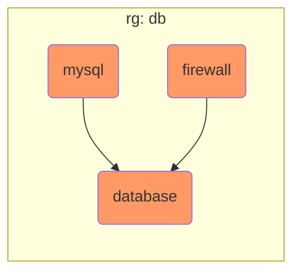

## Step {}.1: Configure AKS egress IP

By default, AKS routes traffic to the internet via a (randomly assigned) Azure public IP. For some scenarios like
our MySQL instance, we want to whitelist the source IP to restrict access to the services.

Add the following content below the resource `azurerm_public_ip.aks_lb_ingress` in `aks.tf`:
```terraform
// optional: only needed to control AKS egress IP(s)
resource "azurerm_public_ip" "aks_lb_egress" {
  name                = "pip-${local.infix}-aks-lb-egress"
  location            = var.location
  resource_group_name = azurerm_resource_group.aks.name
  allocation_method   = "Static"
  sku                 = "Standard"
}
```

To configure AKS to use a static egress IP, modify the `azurerm_kubernetes_cluster.aks` resource in `aks.tf`
and replace the `network_profile` block with the following content:

```terraform
  network_profile {
    network_plugin    = "kubenet"
    load_balancer_sku = "standard"

    // optional: only needed to control AKS egress IP(s)
    load_balancer_profile {
      outbound_ip_address_ids = [azurerm_public_ip.aks_lb_egress.id]
    }
  }
```

Now run
```bash
terraform apply -var-file=config/dev.tfvars
```

To verify the egress IP is correct, run the following command:
```bash
kubectl exec -n tests hello -- curl -s ifconfig.me
```

This lists the egress IP of the AKS cluster as reported by the website https://ifconfig.me

Now verify this IP is equal to the AKS load balancer ip by running:
```bash
terraform state show azurerm_public_ip.aks_lb_egress
```


## Step {}.2: Add a MySQL instance



Create a new file named `mysql.tf` and add the following content:
```terraform
resource "azurerm_resource_group" "db" {
  name     = "rg-${local.infix}-db"
  location = var.location
}

resource "random_password" "mysql" {
  length  = 16
  special = false
}

resource "azurerm_mysql_flexible_server" "demo" {
  name                         = "mdb-${local.infix}"
  resource_group_name          = azurerm_resource_group.db.name
  location                     = azurerm_resource_group.db.location
  administrator_login          = "demo"
  administrator_password       = random_password.mysql.result
  sku_name                     = "B_Standard_B1s"
  backup_retention_days        = 7
  geo_redundant_backup_enabled = false
  version                      = "8.0.21"
  
  storage {
    size_gb = 20
  }
}

resource "azurerm_mysql_flexible_database" "demo_app" {
  name                ="demo_app"
  resource_group_name = azurerm_resource_group.db.name
  server_name         = azurerm_mysql_flexible_server.demo.name
  charset             = "utf8"
  collation           = "utf8_general_ci"
}

resource "azurerm_mysql_flexible_server_firewall_rule" "aks_egress_ip" {
  name                = "aks-egress-ip"
  resource_group_name = azurerm_resource_group.db.name
  server_name         = azurerm_mysql_flexible_server.demo.name
  start_ip_address    = azurerm_public_ip.aks_lb_egress.ip_address
  end_ip_address      = azurerm_public_ip.aks_lb_egress.ip_address
}
```

Create a new file named `outputs.tf` and add the following content:

```terraform
output "mysql_uri" {
  sensitive = true
  value     = format("mysql://%s:%s@%s/%s",
    azurerm_mysql_flexible_server.demo.administrator_login,
    azurerm_mysql_flexible_server.demo.administrator_password,
    azurerm_mysql_flexible_server.demo.fqdn,
    azurerm_mysql_flexible_database.demo_app.name
  )
}
```

Now run
```bash
terraform apply -var-file=config/dev.tfvars
```

The MySQL URI can be displayed by running:
```bash
terraform output mysql_uri
```


### Explanation

The MySQL instance is a managed service by Azure and has a public IP. By default, no IPs are allowed to access
the instance. The resource `azurerm_mysql_flexible_server_firewall_rule.aks_egress_ip` adds a firewall rule to whitelist the egress IP
of the Kubernetes AKS cluster, which allows apps deployed on the cluster to access MySQL.

To configure our demo app, we need to generate a MySQL URI. The Terraform function `format` has familiar syntax to
the GLIBC function `snprintf()` and allows better readable code.
