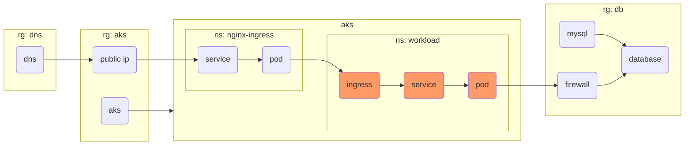

## Step {}.1: Deploy a workload container



To test the setup end-to-end, we deploy an example application on Kubernetes. The app exposes a web service on port
5000 and writes sample records to the MySQL.

Create a Kubernetes secret containing the MySQL URI to be exposed as the POD environment variable `MYSQL_URI`:

```bash
kubectl create namespace workload
kubectl create secret generic mysql-uri --namespace workload --from-literal=mysql_uri=$(terraform output -raw mysql_uri)
```

Create a new file named `tests/workload.yaml` and add the following content:

```yaml
# kubectl apply -f workload.yaml
apiVersion: v1
kind: Pod
metadata:
  name: example
  namespace: workload
  labels:
    app: example
spec:
  containers:
  - image: "quay.io/acend/example-web-python:latest"
    name: example
    ports:
    - containerPort: 5000
      protocol: TCP
    env:
      - name: MYSQL_URI
        valueFrom:
          secretKeyRef:
            name: mysql-uri
            key: mysql_uri

---

apiVersion: v1
kind: Service
metadata:
  name: example
  namespace: workload
spec:
  selector:
    app: example
  ports:
  - protocol: TCP
    port: 5000
    targetPort: 5000

---

apiVersion: networking.k8s.io/v1
kind: Ingress
metadata:
  name: example
  namespace: workload
  annotations:
    nginx.ingress.kubernetes.io/ssl-redirect: "false"
    cert-manager.io/cluster-issuer: letsencrypt-prod
spec:
  ingressClassName: nginx
  tls:
  - hosts:
    - workload.YOUR_USERNAME.labz.ch
    secretName: tls-workload
  rules:
  - host: workload.YOUR_USERNAME.labz.ch
    http:
      paths:
      - path: /
        pathType: Prefix
        backend:
          service:
            name: example
            port:
              number: 5000
```

**Note**: Please replace `YOUR_USERNAME` with the username assigned to you for this workshop.

Deploy the Kubernetes resources by running:

```bash
kubectl apply -f tests/workload.yaml
```

The application is now accessible via web browser at https://workload.YOUR_USERNAME.labz.ch

To verify the application is connected to the MySQL, run the following command to inspec the log files:
```bash
kubectl logs -n workload example | head
```


## Step {}.2: Optional => rewrite yaml to terraform

There are several solutions for how to deploy workload in Kubernetes. You can either use direct yaml files or Helm, but also Terraform itself by using the kubernetes provider.

Check the following documentation to rewrite the yaml content above and deploy it with terraform as well.

* https://registry.terraform.io/providers/hashicorp/kubernetes/latest/docs/resources/pod_v1
* https://registry.terraform.io/providers/hashicorp/kubernetes/latest/docs/resources/service_v1
* https://registry.terraform.io/providers/hashicorp/kubernetes/latest/docs/resources/ingress_v1
