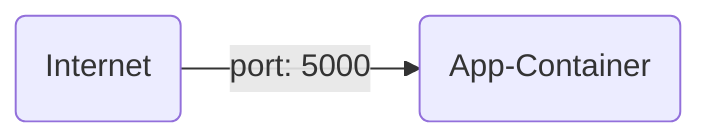

There are situations, where you have a containerized app which should not run in the context of your AKS cluster.
E.g. a monitoring dashbord or health checker, etc.
Or you just simply want to run one container without all of the AKS overhead.
Azrue offers a container runtime for such cases. The ACI - Azure Container Instances. 
This engine allows you to run a simple container in a spearated environment. 


This lab will show you, with a small example, how to archive this.


## Step {}.1: Azure Container Instances

We will create the following:

* Ressource group
* Azure container instance



Create a new folder:

```bash
mkdir $LAB_ROOT/azure/aci
cd $LAB_ROOT/azure/aci
```

Create a new file named `main.tf` and add the following content:
```terraform
provider "azurerm" {
  subscription_id = var.subscription_id
  features {}
}

resource "azurerm_resource_group" "default" {
  name     = "rg-aci-${var.purpose}"
  location = var.location
}

data "azurerm_subscription" "current" {}
```

Now create the new file named `variables.tf` and add:
```terraform
variable "subscription_id" {
  type        = string
  default     = "c1b34118-6a8f-4348-88c2-b0b1f7350f04"
}
variable "purpose" {
  type        = string
  default     = "YOUR_USERNAME"
}
variable "location" {
  type        = string
  default     = "westeurope"
}
```

**Note**: Please replace `YOUR_USERNAME` with the username assigned to you for this workshop.

Finally the ACI file named `aci.tf` and add this:
```terraform
resource "azurerm_container_group" "aci" {
  name                = "go-aci-${var.purpose}"
  location            = azurerm_resource_group.default.location
  resource_group_name = azurerm_resource_group.default.name
  ip_address_type     = "public"
  dns_name_label      = "go-aci-${var.purpose}"
  os_type             = "Linux"

  container {
    name   = "acend-go-example"
    image  = "quay.io/acend/example-web-go:latest"
    cpu    = "0.2"
    memory = "0.2"

    ports {
      port     = 5000
      protocol = "TCP"
    }
  }
  exposed_port {
      port     = 80
      protocol = "TCP"
  }
}

output "fqdn" {
  value = "http://${azurerm_container_group.aci.fqdn}:5000"
}
```

Deploy the Azure resources by running:

```bash
terraform init
terraform apply
```

The application is now accessible via web browser at => `terraform output -raw fqdn`


## Step {}.2: Whats about security?

As you can see, the ACI just offers a simple Container Runtime with direct accessability over the container port.
If you want to have a secured endpoint, you have to find a own solution if container does not provide anything.


You may saw, that the terraform ressource is called `azurerm_container_group`. 
The meaning of that is, you can put several containers in this object.
One case would be, do use a proxy in front of your application to handle the connection endpoint.

```mermaid
graph LR
    A(Internet) --> |port: 443|B
    B(Proxy-Container) --> [port: 5000]C(App-Container)
```

**Your mission, should you decide to accept it, ...**

Add an addtional container acting as a "reverse proxy" to the above example and secure your workload!

**As always, should any of your ressources be crashing or disappearing, the Secretary will disavow any knowledge of your actions.**


Don't where start? Click here:
{}

* check the terraform [documentation](https://registry.terraform.io/providers/hashicorp/azurerm/latest/docs/resources/container_group) how to use addtional containers
* [here](https://github.com/caddyserver/caddy) is an excellent solution to protect endpoints
* how to glue that together? Get an impression in this [blog](https://itnext.io/automatic-https-with-azure-container-instances-aci-4c4c8b03e8c9)

{}


In case of any problems, you can open this section below:
{}
```terraform
resource "azurerm_container_group" "aci" {
  name                = "go-aci-${var.purpose}"
  location            = azurerm_resource_group.default.location
  resource_group_name = azurerm_resource_group.default.name
  ip_address_type     = "public"
  dns_name_label      = "go-aci-${var.purpose}"
  os_type             = "Linux"

  container {
    name   = "acend-go-example"
    image  = "quay.io/acend/example-web-go:latest"
    cpu    = "0.2"
    memory = "0.2"
  }

  container {
    name   = "caddy"
    image  = "caddy"
    cpu    = "0.5"
    memory = "0.5"

    ports {
      port     = 443
      protocol = "TCP"
    }

    ports {
      port     = 80
      protocol = "TCP"
    }

    commands = ["caddy", "reverse-proxy", "--from", "go-aci-${var.purpose}.westeurope.azurecontainer.io", "--to", "localhost:5000"]
  }

}

output "fqdn" {
  value = "https://${azurerm_container_group.aci.fqdn}"
}
```

In this solutions it takes some time to get the certificate from the provider up and running.
Use the command `az container logs -g YOUR_RESSOURCE_GROUP --name YOUR_CONTAINER_GROUP_NAME --container-name caddy` to observe the logfiles from the container.

If you would use this solution in a production environment you have consider a storage to the certificate as well. You can see how in the full solution blog link above.
{}
