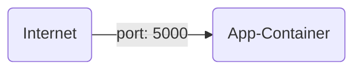
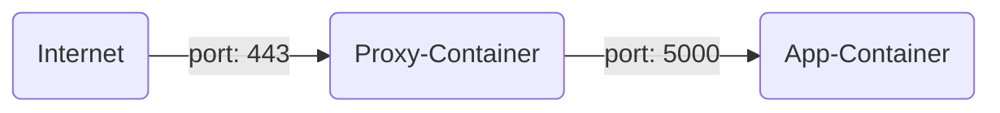

Sometimes, you need to run a containerized application outside of your AKS cluster—for example, a monitoring dashboard,
health checker, or any lightweight utility.  
Or, you might just want to run a single container without the complexity and overhead of managing AKS.

For these scenarios, Azure provides Azure Container Instances (ACI)—a serverless container runtime that allows you to
run containers in an isolated, standalone environment with minimal setup.

This lab provides a simple example to demonstrate how to achieve this.


## Step {}.1: Azure Container Instances

We will create the following:

* Ressource group
* Azure container instance



Create a new folder:

```bash
mkdir $LAB_ROOT/azure/aci
cd $LAB_ROOT/azure/aci
```

Create a new file named `main.tf` and add the following content:
```terraform
provider "azurerm" {
  subscription_id = var.subscription_id
  features {}
}

resource "azurerm_resource_group" "default" {
  name     = "rg-${var.purpose}-aci"
  location = var.location
}

data "azurerm_subscription" "current" {}
```

Now create the new file named `variables.tf` and add:
```terraform
variable "subscription_id" {
  type        = string
  default     = "c1b34118-6a8f-4348-88c2-b0b1f7350f04"
}
variable "purpose" {
  type        = string
  default     = "YOUR_USERNAME"
}
variable "location" {
  type        = string
  default     = "westeurope"
}
```

**Note**: Please replace `YOUR_USERNAME` with the username assigned to you for this workshop.

Finally the ACI file named `aci.tf` and add this:
```terraform
resource "azurerm_container_group" "aci" {
  name                = "go-aci-${var.purpose}"
  location            = azurerm_resource_group.default.location
  resource_group_name = azurerm_resource_group.default.name
  ip_address_type     = "Public"
  dns_name_label      = "go-aci-${var.purpose}"
  os_type             = "Linux"

  container {
    name   = "acend-go-example"
    image  = "quay.io/acend/example-web-go:latest"
    cpu    = "0.2"
    memory = "0.2"

    ports {
      port     = 5000
      protocol = "TCP"
    }
  }
}

output "fqdn" {
  value = "http://${azurerm_container_group.aci.fqdn}:5000"
}
```

Deploy the Azure resources by running:

```bash
terraform init
terraform apply
```

The application is now accessible via web browser at => `terraform output -raw fqdn`


## Step {}.2: What's about security?

As demonstrated, **Azure Container Instances (ACI)** provide a lightweight container runtime with direct access to
the exposed container port.  
However, if your container doesn’t include built-in support for secure endpoints,
**you’ll need to implement your own solution** to secure the connection.

You might have noticed that the Terraform resource is named `azurerm_container_group`.  
This is because it allows you to define **multiple containers within a single container group**.

A common use case is to include a **proxy container** alongside your application to handle secure connections and expose a public or private endpoint.




### Your Mission: Secure the Workload

**Challenge:**  
Extend the previous example by **adding an additional container that acts as a reverse proxy** to secure your application endpoint.

If your resources fail, vanish, or behave unexpectedly, the Secretary will disavow all knowledge of your actions.


### Useful Resources

* Refer to the Terraform [documentation](https://registry.terraform.io/providers/hashicorp/azurerm/latest/docs/resources/container_group)
  to learn how to define additional containers in a container group.
* [Caddy](https://caddyserver.com/docs/) is a powerful and simple solution for securing endpoints with automatic HTTPS.
* Not sure how it all fits together? This [blog post](https://itnext.io/automatic-https-with-azure-container-instances-aci-4c4c8b03e8c9)
  provides a practical example of integrating HTTPS with ACI.

If you run into issues, expand the section below for troubleshooting tips:
{}
```terraform
resource "azurerm_container_group" "aci" {
  name                = "go-aci-${var.purpose}"
  location            = azurerm_resource_group.default.location
  resource_group_name = azurerm_resource_group.default.name
  ip_address_type     = "Public"
  dns_name_label      = "go-aci-${var.purpose}"
  os_type             = "Linux"

  container {
    name   = "acend-go-example"
    image  = "quay.io/acend/example-web-go:latest"
    cpu    = "0.2"
    memory = "0.2"
  }

  container {
    name   = "caddy"
    image  = "caddy"
    cpu    = "0.5"
    memory = "0.5"

    ports {
      port     = 443
      protocol = "TCP"
    }

    ports {
      port     = 80
      protocol = "TCP"
    }

    commands = ["caddy", "reverse-proxy", "--from", "go-aci-${var.purpose}.westeurope.azurecontainer.io", "--to", "localhost:5000"]
  }

}

output "fqdn" {
  value = "https://${azurerm_container_group.aci.fqdn}"
}
```

In this setup, it may take a few moments for the certificate to be issued by the provider and become active.  
To monitor the progress, use the following command to view logs from the Caddy container:
`az container logs -g YOUR_RESOURCE_GROUP --name YOUR_CONTAINER_GROUP_NAME --container-name caddy`

If you’re considering this approach for a production environment, you should also persist the certificate to
external storage. The blog post linked above explains how to implement this.
{}

Do you like this lab? Tell us what you think.
