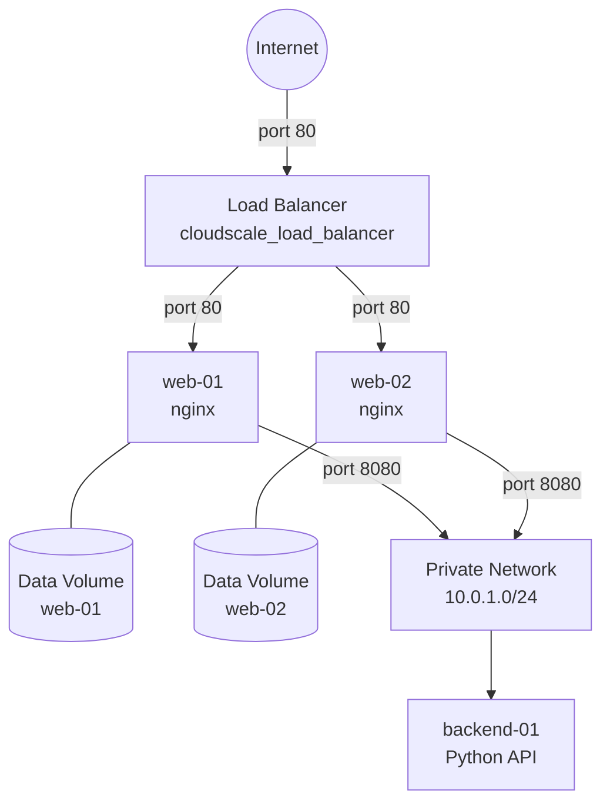

## Overview

Welcome to the **cloudscale.ch Workshop**!

In this chapter you will deploy a highly-available web service on
[cloudscale.ch](https://www.cloudscale.ch/), a Swiss sovereign cloud platform,
using Terraform. You will build the infrastructure incrementally — starting from a single
virtual machine and ending with a fully redundant, load-balanced setup.


## Story: AlpDeploy

You are a cloud engineer at **AlpDeploy**, a fictional Swiss SaaS startup. Management has
decided to run the company's new web service on cloudscale.ch to keep data within
Switzerland and stay in control of the infrastructure. Your task: provision everything
with Terraform.


## Target Architecture

By the end of this chapter, you will have built the following architecture:




## Lab Chapters

| Lab | Topic | Key Resources |
| --- | --- | --- |
| 10.1 | First Server | `cloudscale_server`, cloud-init, metadata service |
| 10.2 | Persistent Storage | `cloudscale_volume` |
| 10.3 | Private Network | `cloudscale_network`, `cloudscale_subnet`, backend server |
| 10.4 | Scaling Out | `cloudscale_server_group`, `for_each` |
| 10.5 | Load Balancer | `cloudscale_load_balancer` full stack |


## Preparation


### API Token

All cloudscale.ch API calls are authenticated via a personal API token. Create one in the
[cloudscale.ch control panel](https://control.cloudscale.ch/) under
**API Tokens → Add Token** and export it in your shell:

```bash
export CLOUDSCALE_API_TOKEN=<your-api-token>
```

{}
The token is read automatically by the cloudscale Terraform provider from the
`CLOUDSCALE_API_TOKEN` environment variable. Keep the token secret and never commit it to
version control.
{}


### Working Directory

Create a dedicated folder for all cloudscale exercises:

```bash
mkdir -p $LAB_ROOT/cloudscale
cd $LAB_ROOT/cloudscale
```


### SSH Key

You will need an SSH public key to access the virtual machines created during the labs.
If you do not yet have one, generate it now:

```bash
ssh-keygen -t ed25519 -f ~/.ssh/id_ed25519
```

Make a note of the public key content — you will paste it into your `terraform.tfvars` file
in the first lab:

```bash
cat ~/.ssh/id_ed25519.pub
```
