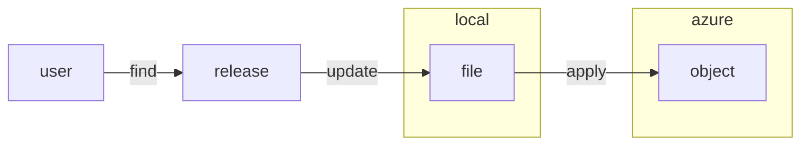

## Preparation

Check all the last chapters for versions.
* required_providers
* kubernetes_version
* helm_release

Find the releases of the software online and update them in youre files. Apply the changes to verfify everything is working well.

