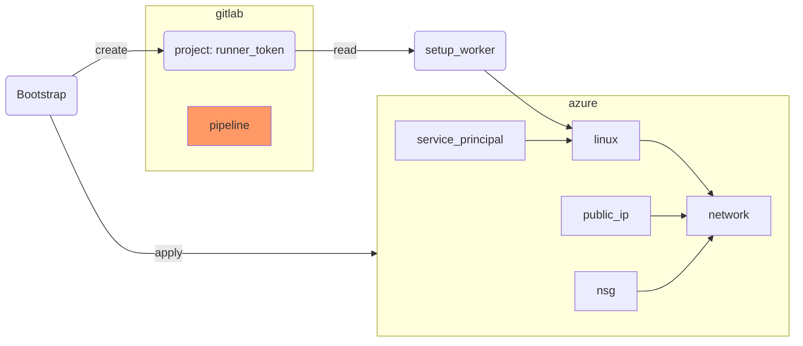

## Preparation

Clone your new repository on a GitLab instance and change into the directory.

Dont forget to get your storage account from Chapter 6.2.1 for:
* `terraform init -backend-config=config/dev_backend.tfvars`


## Step {}.1: main.tf

{}
```terraform
terraform {
  backend "azurerm" {}
}

provider "azurerm" {
  subscription_id = var.subscription_id
  features {
    resource_group {
      prevent_deletion_if_contains_resources = false
    }
  }
}

provider "gitlab" {
  token = var.gitlab_token
}

resource "azurerm_resource_group" "worker" {
  name     = "rg-${local.infix}"
  location = var.location
}

data "azuread_client_config" "current" {}
```
{}

## Step {}.2: variables.tf

{}
```terraform
locals {
  infix = "${var.purpose}-${var.environment}-gitlab"
}

variable "subscription_id" {
  type = string
}

variable "purpose" {
  type = string
}

variable "environment" {
  type = string
}

variable "location" {
  type = string
}

variable "gitlab_project" {
  type = string
}

variable "gitlab_token" {
  type      = string
  sensitive = true
}
```
{}

## Step {}.3: config/dev.tfvars

{}
Take the values from Step 6.2.2

```terraform
subscription_id = "c1b34118-6a8f-4348-88c2-b0b1f7350f04"
purpose         = "YOUR_USERNAME"
environment     = "dev"
location        = "westeurope"
```
{}

## Step {}.4: config/dev_backend.tfvars

{}
Take the values from Step 6.2.2

```terraform
subscription_id      = "c1b34118-6a8f-4348-88c2-b0b1f7350f04"
resource_group_name  = "rg-terraform-YOUR_USERNAME"
storage_account_name = "YOUR_ACCOUNT"
container_name       = "terraform-state"
key                  = "dev_gitlab.tfstate"
```
{}

## Step {}.5: versions.tf

{}
{}
Try always to use the latest version of a plugin
{}

```terraform
terraform {
  required_version = "> 1.12.0"

  required_providers {
    azurerm = {
      source  = "hashicorp/azurerm"
      version = "=4.46.0"
    }
    azuread = {
      source  = "hashicorp/azuread"
      version = ">=3.4.0"
    }
    gitlab = {
      source  = "gitlabhq/gitlab"
      version = "~> 18.0"
    }
    tls = {
      source  = "hashicorp/tls"
      version = ">= 4.1"
    }
    null = {
      source  = "hashicorp/null"
      version = ">= 3.2"
    }
    local = {
      source  = "hashicorp/local"
      version = ">= 2.5"
    }
    time = {
      source  = "hashicorp/time"
      version = ">= 0.13.1"
    }
  }
}
```
{}

## Step {}.6: worker.tf

{}
```terraform
resource "azurerm_virtual_network" "worker" {
  name                = "gitlab-worker"
  address_space       = ["10.0.0.0/16"]
  location            = azurerm_resource_group.worker.location
  resource_group_name = azurerm_resource_group.worker.name
}

resource "azurerm_subnet" "worker" {
  name                 = "gitlab-worker"
  resource_group_name  = azurerm_resource_group.worker.name
  virtual_network_name = azurerm_virtual_network.worker.name
  address_prefixes     = ["10.0.2.0/24"]
}

resource "azurerm_public_ip" "worker" {
  name                = "gitlab-worker"
  resource_group_name = azurerm_resource_group.worker.name
  location            = azurerm_resource_group.worker.location
  allocation_method   = "Static"
}

resource "azurerm_network_interface" "worker" {
  name                = "gitlab-worker"
  location            = azurerm_resource_group.worker.location
  resource_group_name = azurerm_resource_group.worker.name

  ip_configuration {
    name                          = "internal"
    subnet_id                     = azurerm_subnet.worker.id
    private_ip_address_allocation = "Dynamic"
    public_ip_address_id          = azurerm_public_ip.worker.id
  }
}

resource "tls_private_key" "ssh_key" {
  algorithm = "ED25519"
}

resource "azurerm_linux_virtual_machine" "worker" {
  name                = "gitlab-worker"
  resource_group_name = azurerm_resource_group.worker.name
  location            = azurerm_resource_group.worker.location
  size                = "Standard_B1ms"
  admin_username      = var.purpose
  network_interface_ids = [
    azurerm_network_interface.worker.id,
  ]

  identity {
    type = "SystemAssigned"
  }

  admin_ssh_key {
    username   = var.purpose
    public_key = tls_private_key.ssh_key.public_key_openssh
  }

  os_disk {
    caching              = "ReadWrite"
    storage_account_type = "Standard_LRS"
  }

  source_image_reference {
    publisher = "Debian"
    offer     = "debian-13"
    sku       = "13-gen2"
    version   = "latest"
  }
}

resource "azurerm_network_security_group" "worker" {
  name                = "gitlab-worker"
  location            = azurerm_resource_group.worker.location
  resource_group_name = azurerm_resource_group.worker.name

  security_rule {
    name                       = "allow_ssh"
    priority                   = 100
    direction                  = "Inbound"
    access                     = "Allow"
    protocol                   = "Tcp"
    source_port_range          = "*"
    destination_port_range     = "22"
    source_address_prefix      = "*"
    destination_address_prefix = "*"
  }
}

resource "azurerm_network_interface_security_group_association" "worker" {
  network_interface_id      = azurerm_network_interface.worker.id
  network_security_group_id = azurerm_network_security_group.worker.id
}
```
{}

## Step {}.7: access.tf

{}
```terraform
resource "azuread_application" "gitlab" {
  display_name = "GitLab-Pipeline"
  owners       = [data.azuread_client_config.current.object_id]
}

resource "azuread_service_principal" "gitlab" {
  client_id                    = azuread_application.gitlab.client_id
  app_role_assignment_required = false
  owners                       = [data.azuread_client_config.current.object_id]
}

resource "time_rotating" "gitlab" {
  rotation_days = 90
}

resource "azuread_service_principal_password" "gitlab" {
  service_principal_id = azuread_service_principal.gitlab.id
  rotate_when_changed = {
    rotation = time_rotating.gitlab.id
  }
}
```
{}

## Step {}.8: gitlab.tf

{}
```terraform
# GitLab Runner that runs only tagged jobs
resource "gitlab_user_runner" "worker" {
  runner_type = "project_type"
  project_id  = var.gitlab_project
  description = "runner"

  untagged = "false"
  tag_list = ["acend", "terraform", var.purpose]
}

resource "local_sensitive_file" "gitlab_runner" {
  filename = "config.toml"
  content = templatefile("templates/config.tpl", {
    gitlab_runner_token = gitlab_user_runner.worker.token
    client_id           = azuread_application.gitlab.client_id
    client_secret       = azuread_service_principal_password.gitlab.value
  })
}

resource "local_file" "docker_compose" {
  filename = "docker-compose.yaml"
  content  = file("templates/docker-compose.tpl")
}

resource "null_resource" "bootstrap" {
  triggers = {
    vm_change = azurerm_linux_virtual_machine.worker.id
  }

  depends_on = [azurerm_linux_virtual_machine.worker]

  connection {
    type        = "ssh"
    user        = var.purpose
    private_key = tls_private_key.ssh_key.private_key_openssh
    host        = azurerm_public_ip.worker.ip_address
  }

  # install tools, prepare directories, reboot
  provisioner "remote-exec" {
    inline = [
      "sudo apt update",
      "sudo apt install ca-certificates curl unattended-upgrades -y",
      "sudo dpkg-reconfigure -pmedium unattended-upgrades",
      "curl -fsSL https://get.docker.com -o get-docker.sh",
      "which docker || sudo sh get-docker.sh",
      "sudo mkdir -p /data/gitlab /data/cache",
      "sudo chown -R ${var.purpose}:${var.purpose} /data/",
      "sudo addgroup ${var.purpose} docker",
      "sudo systemctl reboot"
    ]
  }
}

resource "null_resource" "start_docker_compose" {
  triggers = {
    gitlab_config  = filesha256("templates/config.tpl")
    compose_config = filesha256("templates/docker-compose.tpl")
  }

  depends_on = [
    null_resource.bootstrap,
    local_file.docker_compose,
    local_sensitive_file.gitlab_runner
  ]

  connection {
    type        = "ssh"
    user        = var.purpose
    private_key = tls_private_key.ssh_key.private_key_openssh
    host        = azurerm_public_ip.worker.ip_address
  }

  # upload gitlab runner config
  provisioner "file" {
    source      = local_sensitive_file.gitlab_runner.filename
    destination = "/data/gitlab/config.toml"
  }

  # upload docker compose file
  provisioner "file" {
    source      = local_file.docker_compose.filename
    destination = "/home/${var.purpose}/docker-compose.yaml"
  }

  # start docker compose (restart runner during run is a bad idea)
  provisioner "remote-exec" {
    inline = [
      "docker compose up -d"
    ]
  }
}
```
{}

## Step {}.9: templates/config.tpl

{}
```conf
concurrent = 2
log_level = "warning"
log_format = "text"
check_interval = 10

[[runners]]
  name = "training"
  token = "${gitlab_runner_token}"
  url = "https://gitlab.com"
  environment = ["ARM_CLIENT_ID=${client_id}", "ARM_CLIENT_SECRET=${client_secret}"]
  executor = "docker"

  [runners.docker]
    image = "alpine:latest"
    cpus = "1"
    memory = "512m"
    dns = ["1.1.1.1"]
    privileged = false
    disable_entrypoint_overwrite = false
    oom_kill_disable = false
    disable_cache = true
    volumes = ["/data/cache:/cache"]
```
{}

## Step {}.10: templates/docker-compose.tpl

{}
```yaml
services:
  gitlab:
    image: gitlab/gitlab-runner:alpine-v18.1.1
    restart: always
    volumes:
    - /data/gitlab:/etc/gitlab-runner:rw
    - /var/run/docker.sock:/var/run/docker.sock:rw
```
{}

## Bonus {}.11: .gitlab-ci.yml

{}
Before starting with the Bonus content you should have applied all the code before. So that the GitLab runner is working.

Lets find out if the runner is functional. Don't forget to commit and push your code for the first run.

```yaml
---
image: alpine

test:
  stage: test
  script:
    - ls -l
  tags:
    - acend
    - terraform
    - <your-tag>
```
{}