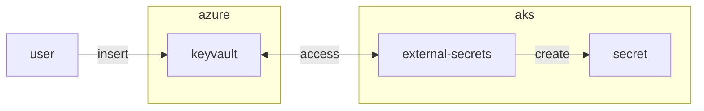

## Preparation

Create a new directory for this exercise:

```bash
mkdir -p $LAB_ROOT/gitlab_runner
cd $LAB_ROOT/gitlab_runner
```

## Step {}.1: keyvault.tf

```terraform
resource "azurerm_key_vault" "aks" {
  name                = "aks"
  location            = var.location
  resource_group_name = azurerm_resource_group.default.name
  tenant_id           = data.azuread_client_config.current.tenant_id
  sku_name            = "standard"
  network_acls {
    bypass         = "AzureServices"
    default_action = "Allow"
  }
  purge_protection_enabled   = true
  soft_delete_retention_days = 7
  rbac_authorization_enabled = true
  tags                       = var.purpose
}

resource "azurerm_role_assignment" "ourself" {
  scope                = azurerm_key_vault.aks.id
  role_definition_name = "Key Vault Secrets Officer"
  principal_id         = data.azuread_client_config.current.object_id
}

resource "azurerm_user_assigned_identity" "podid" {
  name                = "aks-podid"
  resource_group_name = azurerm_resource_group.default.name
  location            = var.location
  tags                = var.purpose
}

resource "azurerm_role_assignment" "podid_access" {
  scope                = azurerm_key_vault.strimzi.id
  role_definition_name = "Key Vault Secrets User"
  principal_id         = azurerm_user_assigned_identity.podid.principal_id
}

resource "azurerm_federated_identity_credential" "federated" {
  name                = "aks-federated-credential"
  resource_group_name = azurerm_resource_group.default.name
  audience            = ["api://AzureADTokenExchange"]
  issuer              = azurerm_kubernetes_cluster.aks.aks_oidc_issuer_url
  parent_id           = azurerm_user_assigned_identity.podid.id
  subject             = "system:serviceaccount:workload:keyvault"
}
```

## Step {}.1: secret.yaml

```yaml
---
apiVersion: external-secrets.io/v1
kind: SecretStore
metadata:
  name: azure-store
  namespace: workload
spec:
  provider:
    azurekv:
      authType: WorkloadIdentity
      vaultUrl: #  azurerm_key_vault.strimzi.vault_uri
      serviceAccountRef:
        name: keyvault
---
apiVersion: external-secrets.io/v1
kind: ExternalSecret
metadata:
  name: demo
  namespace: workload
  labels:
    app: demo
    component: ui
    app.kubernetes.io/name: demo
spec:
  refreshInterval: 1h
  secretStoreRef:
    name: azure-store
    kind: SecretStore
  target:
    name: demo
    creationPolicy: Owner
  data:
    - secretKey: supersecret
      remoteRef:
        key: supersecret
```