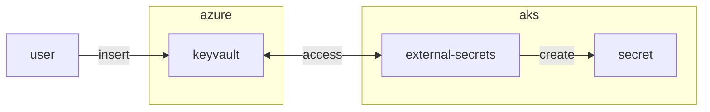

## Preparation

Use the exisiting directory from chapter 6.1

```bash
cd $LAB_ROOT/azure
```

## Step {}.1: keyvault.tf

```terraform
resource "random_integer" "keyvault" {
  min = 10000
  max = 99999
}

resource "azurerm_key_vault" "aks" {
  name                = "kv${replace(local.infix, "-", "")}${random_integer.acr.result}"
  location            = var.location
  resource_group_name = azurerm_resource_group.default.name
  tenant_id           = "79b79954-f1b6-4d8b-868d-7c22edee3e00"
  sku_name            = "standard"
  network_acls {
    bypass         = "AzureServices"
    default_action = "Allow"
  }
  purge_protection_enabled   = true
  soft_delete_retention_days = 7
  rbac_authorization_enabled = true
}

resource "azurerm_role_assignment" "ourself" {
  scope                = azurerm_key_vault.aks.id
  role_definition_name = "Key Vault Secrets Officer"
  principal_id         = data.azuread_group.aks_admins.object_id
}

resource "azurerm_user_assigned_identity" "podid" {
  name                = "aks-podid"
  resource_group_name = azurerm_resource_group.default.name
  location            = var.location
}

resource "azurerm_role_assignment" "podid_access" {
  scope                = azurerm_key_vault.aks.id
  role_definition_name = "Key Vault Secrets User"
  principal_id         = azurerm_user_assigned_identity.podid.principal_id
}

resource "azurerm_federated_identity_credential" "federated" {
  name                = "aks-federated-credential"
  resource_group_name = azurerm_resource_group.default.name
  audience            = ["api://AzureADTokenExchange"]
  issuer              = azurerm_kubernetes_cluster.aks.oidc_issuer_url
  parent_id           = azurerm_user_assigned_identity.podid.id
  subject             = "system:serviceaccount:workload:keyvault"
}

output "vault_uri" {
  value = azurerm_key_vault.aks.vault_uri
}

output "identity" {
  value = azurerm_user_assigned_identity.podid.client_id
}
```


## Step {}.2: external-secrets.tf

```terraform
resource "kubernetes_namespace" "external-secrets" {
  metadata {
    name = "external-secrets"
  }
}

resource "helm_release" "external-secrets" {
  name         = "external-secrets"
  namespace    = kubernetes_namespace.external-secrets.id
  repository   = "https://charts.external-secrets.io"
  chart        = "external-secrets"
  version      = "1.3.1"
  atomic       = true
  reset_values = true
  timeout      = 900

  depends_on = [ azurerm_kubernetes_cluster.aks ]
}
```


## Step {}.3: secret.yaml

```yaml
---
apiVersion: v1
kind: Namespace
metadata:
  name: workload
---
apiVersion: v1
kind: ServiceAccount
metadata:
  name: keyvault
  namespace: workload
  annotations:
    azure.workload.identity/client-id:  # azurerm_user_assigned_identity.podid.client_id ^^
    azure.workload.identity/tenant-id: 79b79954-f1b6-4d8b-868d-7c22edee3e00
---
apiVersion: external-secrets.io/v1
kind: SecretStore
metadata:
  name: azure-store
  namespace: workload
spec:
  provider:
    azurekv:
      authType: WorkloadIdentity
      vaultUrl:  # azurerm_key_vault.aks.vault_uri ^^ (no slash in the end!)
      serviceAccountRef:
        name: keyvault
---
apiVersion: external-secrets.io/v1
kind: ExternalSecret
metadata:
  name: demo
  namespace: workload
spec:
  refreshInterval: 1h
  secretStoreRef:
    name: azure-store
    kind: SecretStore
  target:
    name: supersecret
    creationPolicy: Owner
  data:
    - secretKey: supersecret
      remoteRef:
        key: supersecret
```