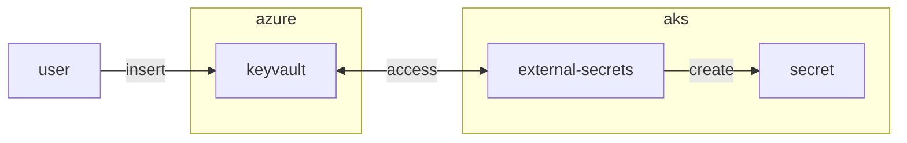

## Preparation

Find your folder which you have used during the training
```bash
cd $LAB_ROOT/<folder>
```

## Step {}.1: local

```bash
terraform fmt -check
tflint
```


## Step {}.2: Dockerfile

```bash
FROM alpine:3.22.1

ARG TERRAFORM_VERSION=v1.12.2
ARG TFLINT_VERSION=v0.58.0

RUN apk --no-cache -U upgrade -a && \
    apk --no-cache add bash ca-certificates curl git grep tree jq figlet unzip yamllint

RUN curl -#L -o terraform.zip "https://releases.hashicorp.com/terraform/${TERRAFORM_VERSION#v}/terraform_${TERRAFORM_VERSION#v}_linux_amd64.zip" && \
    unzip terraform.zip && install -t /usr/local/bin terraform && rm terraform* && \
    # TFLint
    curl -#L -o tflint.zip "https://github.com/terraform-linters/tflint/releases/download/${TFLINT_VERSION}/tflint_linux_amd64.zip" && \
    unzip tflint.zip && install -t /usr/local/bin tflint && rm tflint* && \
    # others
    addgroup infra && adduser -D -G infra infra

USER infra
```

```bash
az acr login -n <your-registry>  # from chapter 6.1
docker buildx build --push -t <your-registry>/builder .
```


## Step {}.3: .gitlab-ci.yml

```yaml
---
image: <your-registry>/builder

stages:
  - linting

variables:
  ARM_TENANT_ID: "c1b34118-6a8f-4348-88c2-b0b1f7350f04"
  TF_PLUGIN_CACHE_MAY_BREAK_DEPENDENCY_LOCK_FILE: "1"
  TF_PLUGIN_CACHE_DIR: "/cache/plugin-cache"

linting:
  stage: linting
  script:
    - find . -name \*.tf -exec terraform fmt -check {} \+
    - tflint  # <-- add
  tags:
    - acend
    - terraform
    - <your-tag>
```
