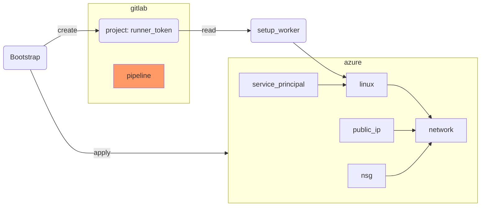

Shared GitLab runners work for many scenarios, but teams that deploy to Azure often need a
**self-hosted runner** that:

* Has network access to private Azure resources
* Can cache Terraform provider plugins locally to speed up pipelines
* Can be tagged so only specific pipelines use it

In this lab we provision a dedicated GitLab Runner on an Azure Linux VM using Terraform.




## Preparation

Create a new directory for this exercise and initialise it from the Azure Workshop remote state
storage created in Chapter 6.2:

```bash
mkdir -p $LAB_ROOT/pipeline/gitlab_runner
cd $LAB_ROOT/pipeline/gitlab_runner
```

In your GitLab project, generate a **Runner registration token**:

* Go to **Settings → CI/CD → Runners → New project runner**
* Add tags `acend`, `terraform`, and your username
* Copy the token — you will need it as a variable

Optional: create empty files:

```bash
touch {main,variables,versions,worker,access,gitlab}.tf
mkdir -p config templates
```


## Step {}.1: versions.tf

{}
```terraform
terraform {
  required_version = "> 1.12.0"

  required_providers {
    azurerm = {
      source  = "hashicorp/azurerm"
      version = "=4.36.0"
    }
    azuread = {
      source  = "hashicorp/azuread"
      version = ">=3.4.0"
    }
    gitlab = {
      source  = "gitlabhq/gitlab"
      version = "~> 18.0"
    }
    tls = {
      source  = "hashicorp/tls"
      version = ">= 4.1"
    }
    null = {
      source  = "hashicorp/null"
      version = ">= 3.2"
    }
    local = {
      source  = "hashicorp/local"
      version = ">= 2.5"
    }
    time = {
      source  = "hashicorp/time"
      version = ">= 0.13.1"
    }
  }
}
```
{}


## Step {}.2: main.tf and variables.tf

{}
```terraform
terraform {
  backend "azurerm" {}
}

provider "azurerm" {
  subscription_id = var.subscription_id
  features {
    resource_group {
      prevent_deletion_if_contains_resources = false
    }
  }
}

provider "gitlab" {
  token = var.gitlab_token
}

resource "azurerm_resource_group" "worker" {
  name     = "rg-${local.infix}"
  location = var.location
}

data "azuread_client_config" "current" {}
```

```terraform
locals {
  infix = "${var.purpose}-${var.environment}-gitlab"
}

variable "subscription_id" {
  description = "Azure subscription ID."
  type        = string
}

variable "purpose" {
  description = "Short identifier used in resource names."
  type        = string
}

variable "environment" {
  description = "Environment name (e.g. dev, prod)."
  type        = string
}

variable "location" {
  description = "Azure region."
  type        = string
}

variable "gitlab_project" {
  description = "GitLab project ID (numeric) to register the runner against."
  type        = string
}

variable "gitlab_token" {
  description = "GitLab personal access token with runner registration permissions."
  type        = string
  sensitive   = true
}
```
{}


## Step {}.3: Config files

Don't forget to get your storage account from Chapter 6.2 for the backend config.

{}
`config/dev.tfvars`:

```terraform
subscription_id = "c1b34118-6a8f-4348-88c2-b0b1f7350f04"
purpose         = "YOUR_USERNAME"
environment     = "dev"
location        = "westeurope"
gitlab_project  = "YOUR_GITLAB_PROJECT_ID"
```

`config/dev_backend.tfvars`:

```terraform
subscription_id      = "c1b34118-6a8f-4348-88c2-b0b1f7350f04"
resource_group_name  = "rg-terraform-YOUR_USERNAME"
storage_account_name = "YOUR_ACCOUNT"
container_name       = "terraform-state"
key                  = "dev_gitlab.tfstate"
```
{}

Init Terraform with the backend config:

```bash
terraform init -backend-config=config/dev_backend.tfvars
```


## Step {}.4: worker.tf – Azure VM

{}
```terraform
resource "azurerm_virtual_network" "worker" {
  name                = "gitlab-worker"
  address_space       = ["10.0.0.0/16"]
  location            = azurerm_resource_group.worker.location
  resource_group_name = azurerm_resource_group.worker.name
}

resource "azurerm_subnet" "worker" {
  name                 = "gitlab-worker"
  resource_group_name  = azurerm_resource_group.worker.name
  virtual_network_name = azurerm_virtual_network.worker.name
  address_prefixes     = ["10.0.2.0/24"]
}

resource "azurerm_public_ip" "worker" {
  name                = "gitlab-worker"
  resource_group_name = azurerm_resource_group.worker.name
  location            = azurerm_resource_group.worker.location
  allocation_method   = "Static"
}

resource "azurerm_network_interface" "worker" {
  name                = "gitlab-worker"
  location            = azurerm_resource_group.worker.location
  resource_group_name = azurerm_resource_group.worker.name

  ip_configuration {
    name                          = "internal"
    subnet_id                     = azurerm_subnet.worker.id
    private_ip_address_allocation = "Dynamic"
    public_ip_address_id          = azurerm_public_ip.worker.id
  }
}

resource "tls_private_key" "ssh_key" {
  algorithm = "ED25519"
}

resource "azurerm_linux_virtual_machine" "worker" {
  name                = "gitlab-worker"
  resource_group_name = azurerm_resource_group.worker.name
  location            = azurerm_resource_group.worker.location
  size                = "Standard_B1ms"
  admin_username      = var.purpose
  network_interface_ids = [
    azurerm_network_interface.worker.id,
  ]

  identity {
    type = "SystemAssigned"
  }

  admin_ssh_key {
    username   = var.purpose
    public_key = tls_private_key.ssh_key.public_key_openssh
  }

  os_disk {
    caching              = "ReadWrite"
    storage_account_type = "Standard_LRS"
  }

  source_image_reference {
    publisher = "Debian"
    offer     = "debian-13"
    sku       = "13-gen2"
    version   = "latest"
  }
}

resource "azurerm_network_security_group" "worker" {
  name                = "gitlab-worker"
  location            = azurerm_resource_group.worker.location
  resource_group_name = azurerm_resource_group.worker.name

  security_rule {
    name                       = "allow_ssh"
    priority                   = 100
    direction                  = "Inbound"
    access                     = "Allow"
    protocol                   = "Tcp"
    source_port_range          = "*"
    destination_port_range     = "22"
    source_address_prefix      = "*"
    destination_address_prefix = "*"
  }
}

resource "azurerm_network_interface_security_group_association" "worker" {
  network_interface_id      = azurerm_network_interface.worker.id
  network_security_group_id = azurerm_network_security_group.worker.id
}
```
{}


## Step {}.5: access.tf – Service Principal

{}
```terraform
resource "azuread_application" "gitlab" {
  display_name = "GitLab-Pipeline"
  owners       = [data.azuread_client_config.current.object_id]
}

resource "azuread_service_principal" "gitlab" {
  client_id                    = azuread_application.gitlab.client_id
  app_role_assignment_required = false
  owners                       = [data.azuread_client_config.current.object_id]
}

resource "time_rotating" "gitlab" {
  rotation_days = 90
}

resource "azuread_service_principal_password" "gitlab" {
  service_principal_id = azuread_service_principal.gitlab.id
  rotate_when_changed = {
    rotation = time_rotating.gitlab.id
  }
}
```
{}

### Explanation

The `time_rotating` resource triggers a secret rotation every 90 days. When the rotation date
passes, `rotate_when_changed` detects the change and Terraform automatically generates a new
service principal password on the next apply — without any manual intervention.


## Step {}.6: gitlab.tf – Runner registration and bootstrap

{}
```terraform
resource "gitlab_user_runner" "worker" {
  runner_type = "project_type"
  project_id  = var.gitlab_project
  description = "runner"
  untagged    = false
  tag_list    = ["acend", "terraform", var.purpose]
}

resource "local_sensitive_file" "gitlab_runner" {
  filename = "config.toml"
  content = templatefile("templates/config.tpl", {
    gitlab_runner_token = gitlab_user_runner.worker.token
    client_id           = azuread_application.gitlab.client_id
    client_secret       = azuread_service_principal_password.gitlab.value
  })
}

resource "local_file" "docker_compose" {
  filename = "docker-compose.yaml"
  content  = file("templates/docker-compose.tpl")
}

resource "null_resource" "bootstrap" {
  triggers = {
    vm_change = azurerm_linux_virtual_machine.worker.id
  }

  depends_on = [azurerm_linux_virtual_machine.worker]

  connection {
    type        = "ssh"
    user        = var.purpose
    private_key = tls_private_key.ssh_key.private_key_openssh
    host        = azurerm_public_ip.worker.ip_address
  }

  provisioner "remote-exec" {
    inline = [
      "sudo apt update",
      "sudo apt install ca-certificates curl unattended-upgrades -y",
      "sudo dpkg-reconfigure -pmedium unattended-upgrades",
      "curl -fsSL https://get.docker.com -o get-docker.sh",
      "which docker || sudo sh get-docker.sh",
      "sudo mkdir -p /data/gitlab /data/cache",
      "sudo chown -R ${var.purpose}:${var.purpose} /data/",
      "sudo adduser ${var.purpose} docker",
      "sudo systemctl reboot"
    ]
  }
}

resource "null_resource" "start_docker_compose" {
  triggers = {
    gitlab_config  = filesha256("templates/config.tpl")
    compose_config = filesha256("templates/docker-compose.tpl")
  }

  depends_on = [
    null_resource.bootstrap,
    local_file.docker_compose,
    local_sensitive_file.gitlab_runner
  ]

  connection {
    type        = "ssh"
    user        = var.purpose
    private_key = tls_private_key.ssh_key.private_key_openssh
    host        = azurerm_public_ip.worker.ip_address
  }

  provisioner "file" {
    source      = local_sensitive_file.gitlab_runner.filename
    destination = "/data/gitlab/config.toml"
  }

  provisioner "file" {
    source      = local_file.docker_compose.filename
    destination = "/home/${var.purpose}/docker-compose.yaml"
  }

  provisioner "remote-exec" {
    inline = [
      "docker compose up -d"
    ]
  }
}
```
{}

### Explanation

`null_resource` with `remote-exec` and `file` provisioners is a pragmatic way to bootstrap a VM
without a configuration management tool. The `triggers` map re-runs the provisioner whenever the
VM is replaced or the template files change.

`local_sensitive_file` generates the GitLab Runner `config.toml` locally from a template. The
`sensitive` variant ensures the file content (which contains the runner token) is treated as
sensitive in Terraform state and logs.


## Step {}.7: Runner config templates

Create `templates/config.tpl`:

```
concurrent = 1
check_interval = 0

[[runners]]
  name = "terraform-runner"
  url = "https://gitlab.com/"
  token = "${gitlab_runner_token}"
  executor = "docker"
  [runners.docker]
    image = "alpine:latest"
    volumes = ["/cache:/cache", "/data/cache:/data/cache"]
  [runners.cache]
    Type = "local"
    Path = "/data/cache"
```

Create `templates/docker-compose.tpl`:

```yaml
---
services:
  gitlab-runner:
    image: gitlab/gitlab-runner:latest
    restart: always
    volumes:
      - /data/gitlab:/etc/gitlab-runner
      - /var/run/docker.sock:/var/run/docker.sock
```

Now apply:

```bash
terraform apply -var-file=config/dev.tfvars
```

Verify the runner appears under **Settings → CI/CD → Runners** in your GitLab project.
