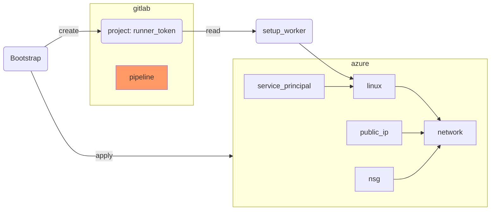

Shared GitLab runners work for many scenarios, but teams that deploy to Azure often need a
**self-hosted runner** that:

* Has network access to private Azure resources
* Can cache Terraform provider plugins locally to speed up pipelines
* Can be tagged so only specific pipelines use it

In this lab we provision a dedicated GitLab Runner on an Azure Linux VM using Terraform.
The overall flow looks like this: a local Terraform apply bootstraps an Azure VM, registers
a runner token with GitLab, and then uses SSH provisioners to install Docker and start the
GitLab Runner container on the VM.




## Preparation

Create a new directory for this exercise and initialise it from the Azure Workshop remote state
storage created in Chapter 6.2:

```bash
mkdir -p $LAB_ROOT/pipeline/gitlab_runner
cd $LAB_ROOT/pipeline/gitlab_runner
```

In your GitLab project, generate a **Runner registration token**:

* Go to **Settings → CI/CD → Runners → New project runner**
* Add tags `acend`, `terraform`, and your username
* Copy the token — you will need it as a variable

Create the empty files you will fill in the steps below:

```bash
touch {main,variables,versions,worker,access,gitlab}.tf
mkdir -p config templates
```


## Step {}.1: versions.tf

This project uses seven providers. In addition to the usual `azurerm` and `azuread` providers
for Azure resources, we add:

* `gitlabhq/gitlab` — to create the runner token and register it against the project
* `hashicorp/tls` — to generate an ED25519 SSH key pair for VM access
* `hashicorp/null` — for the `null_resource` provisioners that bootstrap the VM
* `hashicorp/local` — to write the rendered `config.toml` and `docker-compose.yaml` to disk
* `hashicorp/time` — to drive automatic credential rotation every 90 days

```terraform
terraform {
  required_version = "> 1.12.0"

  required_providers {
    azurerm = {
      source  = "hashicorp/azurerm"
      version = "=4.36.0"
    }
    azuread = {
      source  = "hashicorp/azuread"
      version = ">=3.4.0"
    }
    gitlab = {
      source  = "gitlabhq/gitlab"
      version = "~> 18.0"
    }
    tls = {
      source  = "hashicorp/tls"
      version = ">= 4.1"
    }
    null = {
      source  = "hashicorp/null"
      version = ">= 3.2"
    }
    local = {
      source  = "hashicorp/local"
      version = ">= 2.5"
    }
    time = {
      source  = "hashicorp/time"
      version = ">= 0.13.1"
    }
  }
}
```


## Step {}.2: main.tf and variables.tf

`main.tf` wires together the backend, the two cloud providers, a resource group, and a data
source that reads the identity of the currently logged-in Azure AD user. The resource group
name is constructed from a local `infix` value so all resources share a consistent naming
prefix. The `azurerm` feature block disables the safety guard that normally blocks deletion of
non-empty resource groups — useful during lab teardown.

```terraform
terraform {
  backend "azurerm" {}
}

provider "azurerm" {
  subscription_id = var.subscription_id
  features {
    resource_group {
      prevent_deletion_if_contains_resources = false
    }
  }
}

provider "gitlab" {
  token = var.gitlab_token
}

resource "azurerm_resource_group" "worker" {
  name     = "rg-${local.infix}"
  location = var.location
}

data "azuread_client_config" "current" {}
```

The variables file defines inputs for subscription, naming, location, and GitLab access. The
`gitlab_token` variable is marked `sensitive` so Terraform never prints its value in plan
output or logs.

```terraform
locals {
  infix = "${var.purpose}-${var.environment}-gitlab"
}

variable "subscription_id" {
  description = "Azure subscription ID."
  type        = string
}

variable "purpose" {
  description = "Short identifier used in resource names."
  type        = string
}

variable "environment" {
  description = "Environment name (e.g. dev, prod)."
  type        = string
}

variable "location" {
  description = "Azure region."
  type        = string
}

variable "gitlab_project" {
  description = "GitLab project ID (numeric) to register the runner against."
  type        = string
}

variable "gitlab_token" {
  description = "GitLab personal access token with runner registration permissions."
  type        = string
  sensitive   = true
}
```


## Step {}.3: Config files

The two config files separate deployment-specific values (subscription, storage account) from
the Terraform code itself. The backend config is passed to `terraform init` so the state file
is stored in Azure Blob Storage rather than locally — essential for pipeline usage.

Get your storage account name from Chapter 6.2 and replace the placeholders below.

`config/dev.tfvars`:

```terraform
subscription_id = "c1b34118-6a8f-4348-88c2-b0b1f7350f04"
purpose         = "YOUR_USERNAME"
environment     = "dev"
location        = "westeurope"
gitlab_project  = "YOUR_GITLAB_PROJECT_ID"
```

`config/dev_backend.tfvars`:

```terraform
subscription_id      = "c1b34118-6a8f-4348-88c2-b0b1f7350f04"
resource_group_name  = "rg-terraform-YOUR_USERNAME"
storage_account_name = "YOUR_ACCOUNT"
container_name       = "terraform-state"
key                  = "dev_gitlab.tfstate"
```

Init Terraform with the backend config:

```bash
terraform init -backend-config=config/dev_backend.tfvars
```


## Step {}.4: worker.tf – Azure VM

This file provisions the complete network stack and the VM itself. The key design decisions are:

* A **static public IP** is used so the IP address is known before the VM boots — the SSH
  provisioners in a later step need a stable target address.
* An **ED25519 SSH key pair** is generated by Terraform using the `tls` provider. The private
  key stays in Terraform state (sensitive); the public key is injected into the VM via
  `admin_ssh_key`.
* A **Network Security Group** allows inbound SSH (port 22) so the provisioners can connect.
  In a production setup you would restrict `source_address_prefix` to a known IP range.
* The VM uses a **Debian 13** image on a `Standard_B1ms` SKU — small enough for a lab but
  sufficient to run Docker and the GitLab Runner container.

```terraform
resource "azurerm_virtual_network" "worker" {
  name                = "gitlab-worker"
  address_space       = ["10.0.0.0/16"]
  location            = azurerm_resource_group.worker.location
  resource_group_name = azurerm_resource_group.worker.name
}

resource "azurerm_subnet" "worker" {
  name                 = "gitlab-worker"
  resource_group_name  = azurerm_resource_group.worker.name
  virtual_network_name = azurerm_virtual_network.worker.name
  address_prefixes     = ["10.0.2.0/24"]
}

resource "azurerm_public_ip" "worker" {
  name                = "gitlab-worker"
  resource_group_name = azurerm_resource_group.worker.name
  location            = azurerm_resource_group.worker.location
  allocation_method   = "Static"
}

resource "azurerm_network_interface" "worker" {
  name                = "gitlab-worker"
  location            = azurerm_resource_group.worker.location
  resource_group_name = azurerm_resource_group.worker.name

  ip_configuration {
    name                          = "internal"
    subnet_id                     = azurerm_subnet.worker.id
    private_ip_address_allocation = "Dynamic"
    public_ip_address_id          = azurerm_public_ip.worker.id
  }
}

resource "tls_private_key" "ssh_key" {
  algorithm = "ED25519"
}

resource "azurerm_linux_virtual_machine" "worker" {
  name                = "gitlab-worker"
  resource_group_name = azurerm_resource_group.worker.name
  location            = azurerm_resource_group.worker.location
  size                = "Standard_B1ms"
  admin_username      = var.purpose
  network_interface_ids = [
    azurerm_network_interface.worker.id,
  ]

  identity {
    type = "SystemAssigned"
  }

  admin_ssh_key {
    username   = var.purpose
    public_key = tls_private_key.ssh_key.public_key_openssh
  }

  os_disk {
    caching              = "ReadWrite"
    storage_account_type = "Standard_LRS"
  }

  source_image_reference {
    publisher = "Debian"
    offer     = "debian-13"
    sku       = "13-gen2"
    version   = "latest"
  }
}

resource "azurerm_network_security_group" "worker" {
  name                = "gitlab-worker"
  location            = azurerm_resource_group.worker.location
  resource_group_name = azurerm_resource_group.worker.name

  security_rule {
    name                       = "allow_ssh"
    priority                   = 100
    direction                  = "Inbound"
    access                     = "Allow"
    protocol                   = "Tcp"
    source_port_range          = "*"
    destination_port_range     = "22"
    source_address_prefix      = "*"
    destination_address_prefix = "*"
  }
}

resource "azurerm_network_interface_security_group_association" "worker" {
  network_interface_id      = azurerm_network_interface.worker.id
  network_security_group_id = azurerm_network_security_group.worker.id
}
```


## Step {}.5: access.tf – Service Principal

The pipeline running on the GitLab Runner needs its own Azure identity to call the Azure API —
separate from your personal credentials. This file creates an Azure AD application and a
service principal, then attaches a password that rotates automatically every 90 days.

The `time_rotating` resource tracks the rotation schedule. The `rotate_when_changed` argument
on `azuread_service_principal_password` watches for changes in the `time_rotating` output: once
the 90-day mark is crossed, the resource is marked as changed on the next `terraform plan`, so
a subsequent `terraform apply` generates a fresh password without any manual work.

```terraform
resource "azuread_application" "gitlab" {
  display_name = "GitLab-Pipeline"
  owners       = [data.azuread_client_config.current.object_id]
}

resource "azuread_service_principal" "gitlab" {
  client_id                    = azuread_application.gitlab.client_id
  app_role_assignment_required = false
  owners                       = [data.azuread_client_config.current.object_id]
}

resource "time_rotating" "gitlab" {
  rotation_days = 90
}

resource "azuread_service_principal_password" "gitlab" {
  service_principal_id = azuread_service_principal.gitlab.id
  rotate_when_changed = {
    rotation = time_rotating.gitlab.id
  }
}
```


## Step {}.6: gitlab.tf – Runner registration and bootstrap

This is the heart of the lab — it ties everything together. There are four logical parts:

1. **`gitlab_user_runner`** — calls the GitLab API to create a runner token scoped to your
   project. The token is only used internally (in the rendered `config.toml`) and never needs
   to leave Terraform state.

2. **`local_sensitive_file` / `local_file`** — render the runner config and Docker Compose file
   from templates onto the local disk. Terraform needs the files locally before it can upload
   them via SSH.

3. **`null_resource.bootstrap`** — SSHes into the fresh VM and installs Docker, then reboots.
   The `triggers` map ties this to the VM's resource ID so the block re-runs automatically if
   the VM is ever replaced.

4. **`null_resource.start_docker_compose`** — waits for the bootstrap to complete (`depends_on`),
   uploads the two config files via `file` provisioners, then starts the runner container with
   `docker compose up -d`. Its `triggers` watch the template file checksums so any config change
   causes a re-deploy.

```terraform
resource "gitlab_user_runner" "worker" {
  runner_type = "project_type"
  project_id  = var.gitlab_project
  description = "runner"
  untagged    = false
  tag_list    = ["acend", "terraform", var.purpose]
}

resource "local_sensitive_file" "gitlab_runner" {
  filename = "config.toml"
  content = templatefile("templates/config.tpl", {
    gitlab_runner_token = gitlab_user_runner.worker.token
    client_id           = azuread_application.gitlab.client_id
    client_secret       = azuread_service_principal_password.gitlab.value
  })
}

resource "local_file" "docker_compose" {
  filename = "docker-compose.yaml"
  content  = file("templates/docker-compose.tpl")
}

resource "null_resource" "bootstrap" {
  triggers = {
    vm_change = azurerm_linux_virtual_machine.worker.id
  }

  depends_on = [azurerm_linux_virtual_machine.worker]

  connection {
    type        = "ssh"
    user        = var.purpose
    private_key = tls_private_key.ssh_key.private_key_openssh
    host        = azurerm_public_ip.worker.ip_address
  }

  provisioner "remote-exec" {
    inline = [
      "sudo apt update",
      "sudo apt install ca-certificates curl unattended-upgrades -y",
      "sudo dpkg-reconfigure -pmedium unattended-upgrades",
      "curl -fsSL https://get.docker.com -o get-docker.sh",
      "which docker || sudo sh get-docker.sh",
      "sudo mkdir -p /data/gitlab /data/cache",
      "sudo chown -R ${var.purpose}:${var.purpose} /data/",
      "sudo adduser ${var.purpose} docker",
      "sudo systemctl reboot"
    ]
  }
}

resource "null_resource" "start_docker_compose" {
  triggers = {
    gitlab_config  = filesha256("templates/config.tpl")
    compose_config = filesha256("templates/docker-compose.tpl")
  }

  depends_on = [
    null_resource.bootstrap,
    local_file.docker_compose,
    local_sensitive_file.gitlab_runner
  ]

  connection {
    type        = "ssh"
    user        = var.purpose
    private_key = tls_private_key.ssh_key.private_key_openssh
    host        = azurerm_public_ip.worker.ip_address
  }

  provisioner "file" {
    source      = local_sensitive_file.gitlab_runner.filename
    destination = "/data/gitlab/config.toml"
  }

  provisioner "file" {
    source      = local_file.docker_compose.filename
    destination = "/home/${var.purpose}/docker-compose.yaml"
  }

  provisioner "remote-exec" {
    inline = [
      "docker compose up -d"
    ]
  }
}
```


## Step {}.7: Runner config templates

The two templates are rendered by Terraform's `templatefile` function and `file` function
respectively. The runner config tells the GitLab Runner which GitLab instance to connect to,
which executor to use (Docker), and where to store the local cache. The Docker Compose file
defines the container that runs the GitLab Runner process and mounts the Docker socket so the
runner can spin up Docker-in-Docker job containers.

Create `templates/config.tpl`:

```
concurrent = 1
check_interval = 0

[[runners]]
  name = "terraform-runner"
  url = "https://gitlab.com/"
  token = "${gitlab_runner_token}"
  executor = "docker"
  [runners.docker]
    image = "alpine:latest"
    volumes = ["/cache:/cache", "/data/cache:/data/cache"]
  [runners.cache]
    Type = "local"
    Path = "/data/cache"
```

Create `templates/docker-compose.tpl`:

```yaml
---
services:
  gitlab-runner:
    image: gitlab/gitlab-runner:latest
    restart: always
    volumes:
      - /data/gitlab:/etc/gitlab-runner
      - /var/run/docker.sock:/var/run/docker.sock
```

Now apply:

```bash
terraform apply -var-file=config/dev.tfvars
```

Verify the runner appears under **Settings → CI/CD → Runners** in your GitLab project.

