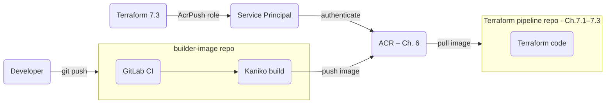

Building a custom Docker image inside a CI pipeline — without access to a Docker daemon — is a
common requirement when using container-based runners.
[Kaniko](https://github.com/GoogleContainerTools/kaniko) solves this by executing each Dockerfile
instruction in user-space, writing directly to container filesystem layers instead of relying on
the host Docker socket.

In this lab you:

* Extend the Terraform code from Lab 7.3 to grant the service principal **AcrPush** access on
  the Azure Container Registry created in Chapter 6.
* Create a **dedicated GitLab repository** for the builder image — separate from the
  Terraform pipeline repository used in Chapters 7.1–7.3.
* Write a `Dockerfile` that bundles `terraform` and `tflint` for use in pipeline jobs.
* Add a simple `.gitlab-ci.yml` that uses Kaniko to build and push the image to ACR whenever
  the `Dockerfile` changes.

Keeping the image repository separate from the Terraform code repository is a common
practice: the two repositories have different lifecycles (the image changes when tool versions
change; Terraform code changes when infrastructure changes) and different access-control
requirements.




## Preparation

The Terraform changes in Step {}.1 belong to the existing GitLab Runner
directory from Lab 7.3. The Dockerfile and its pipeline live in a **new, dedicated GitLab project**
that you create now.

In GitLab, create a new blank project (e.g. `builder-image`) and clone it:

```bash
mkdir -p $LAB_ROOT/pipeline/builder-image
cd $LAB_ROOT/pipeline/builder-image
git init
git remote add origin <your-builder-image-repo-url>
```


## Step {}.1: Grant the Service Principal AcrPush on the registry

{}
This step modifies the **existing Terraform directory from Lab 7.3** (`$LAB_ROOT/pipeline/gitlab_runner`),
not the new builder-image repository.
{}

The service principal managed in `access.tf` (Lab 7.3) needs the **AcrPush** role on the ACR
so that Kaniko can authenticate and push built images. Add a data source that reads the existing
registry by name and a role assignment that scopes the permission to it.

Switch to the Lab 7.3 directory:

```bash
cd $LAB_ROOT/pipeline/gitlab_runner
```

Add the following variables to `variables.tf`:

```terraform
variable "acr_name" {
  description = "Name of the Azure Container Registry created in Chapter 6."
  type        = string
}

variable "acr_resource_group" {
  description = "Resource group that contains the ACR from Chapter 6."
  type        = string
}
```

Create a new file named `registry.tf`:

```terraform
data "azurerm_container_registry" "pipeline" {
  name                = var.acr_name
  resource_group_name = var.acr_resource_group
}

resource "azurerm_role_assignment" "sp_acr_push" {
  scope                = data.azurerm_container_registry.pipeline.id
  role_definition_name = "AcrPush"
  principal_id         = azuread_service_principal.gitlab.object_id
}

output "acr_login_server" {
  description = "FQDN of the Azure Container Registry login server."
  value       = data.azurerm_container_registry.pipeline.login_server
}
```

Use `az acr list` to find the ACR name and its resource group:

```bash
az acr list --query "[].{name:name,resourceGroup:resourceGroup}" -o table
```

Add the two new variable values to `config/dev.tfvars`:

```terraform
acr_name           = "cr<your-infix><random-digits>"
acr_resource_group = "rg-<your-username>-dev-aks"
```

Apply the changes:

```bash
terraform apply -var-file=config/dev.tfvars
```

Note the `acr_login_server` output — you will store it as a GitLab CI variable in Step
{}.3.

### Explanation

`data "azurerm_container_registry"` reads the existing registry from the Azure API rather than
creating a new one. This is the recommended pattern when the resource is owned by a separate
Terraform workspace (here: Chapter 6).

The [AcrPush built-in role](https://learn.microsoft.com/en-us/azure/container-registry/container-registry-roles)
grants pull and push access but not registry-level administrative operations. Granting only the
minimum required role follows the principle of least privilege.


## Step {}.2: Create the Dockerfile

Switch to the new builder-image repository and add a `Dockerfile` that packages `terraform`
and `tflint` as static binaries on top of Alpine Linux:

```bash
cd $LAB_ROOT/pipeline/builder-image
```

```dockerfile
FROM alpine:3.23.3

ARG TERRAFORM_VERSION=v1.12.2
ARG TFLINT_VERSION=v0.58.0

RUN apk --no-cache -U upgrade -a && \
    apk --no-cache add bash ca-certificates curl git grep tree jq figlet unzip yamllint

RUN curl -#L -o terraform.zip \
        "https://releases.hashicorp.com/terraform/${TERRAFORM_VERSION#v}/terraform_${TERRAFORM_VERSION#v}_linux_amd64.zip" && \
    unzip terraform.zip && install -t /usr/local/bin terraform && rm terraform* && \
    curl -#L -o tflint.zip \
        "https://github.com/terraform-linters/tflint/releases/download/${TFLINT_VERSION}/tflint_linux_amd64.zip" && \
    unzip tflint.zip && install -t /usr/local/bin tflint && rm tflint* && \
    addgroup infra && adduser -D -G infra infra

USER infra
```

{}
Pin `TERRAFORM_VERSION` and `TFLINT_VERSION` to the same releases used in your `versions.tf`
to guarantee that pipeline validation runs against the exact versions your team has agreed on.
{}


## Step {}.3: Store CI variables in the builder-image project

In the **builder-image GitLab project** go to **Settings → CI/CD → Variables** and add the
following three variables. The service principal credentials are the same ones created in Lab 7.2
— add them again here because GitLab CI variables are scoped per project.

| Variable | Value | Masked | Protected |
| --- | --- | --- | --- |
| `ACR_REGISTRY_SERVER` | value from `terraform output acr_login_server` | no | yes |
| `ARM_CLIENT_ID` | `appId` from Lab 7.2 | yes | yes |
| `ARM_CLIENT_SECRET` | `password` from Lab 7.2 | yes | yes |


## Step {}.4: Create `.gitlab-ci.yml` in the builder-image repository

[Kaniko](https://github.com/GoogleContainerTools/kaniko) builds Docker images inside a standard
container without requiring a privileged Docker daemon or `docker:dind`. It reads the
`Dockerfile`, executes each layer in user-space, and pushes the result directly to the registry.

Because the builder-image repository contains only the `Dockerfile` and no Terraform code, the
pipeline is intentionally minimal — a single `build-image` job with no Terraform stages. The
`-debug` Kaniko image variant ships with Busybox, which provides the shell required by the
`script:` block.

Create `.gitlab-ci.yml` at the root of the builder-image repository:

```yaml
---
stages:
  - build

build-image:
  stage: build
  image:
    name: gcr.io/kaniko-project/executor:v1.23.2-debug
    entrypoint: [""]
  script:
    - mkdir -p /kaniko/.docker
    - AUTH=$(echo -n "${ARM_CLIENT_ID}:${ARM_CLIENT_SECRET}" | base64 -w 0)
    - echo "{\"auths\":{\"${ACR_REGISTRY_SERVER}\":{\"auth\":\"${AUTH}\"}}}" > /kaniko/.docker/config.json
    - /kaniko/executor
        --context "${CI_PROJECT_DIR}"
        --dockerfile "${CI_PROJECT_DIR}/Dockerfile"
        --destination "${ACR_REGISTRY_SERVER}/builder:latest"
        --destination "${ACR_REGISTRY_SERVER}/builder:${CI_COMMIT_SHORT_SHA}"
  tags:
    - acend
    - terraform
    - <your-tag>
  rules:
    - if: $CI_COMMIT_BRANCH == $CI_DEFAULT_BRANCH
      changes:
        - Dockerfile
    - when: never
```

Commit and push both files:

```bash
git add Dockerfile .gitlab-ci.yml
git commit -m "ci: add Kaniko build pipeline for builder image"
git push --set-upstream origin main
```

Watch the pipeline in **CI/CD → Pipelines** of the builder-image project. Once the job turns
green, the image is available in ACR and the Terraform pipeline (Lab 7.5) can reference it.

### Explanation

Kaniko authenticates with ACR using the service principal credentials stored as GitLab CI
variables. Docker registries expect the `auth` field in `config.json` to be the base64 encoding
of `<username>:<password>`. For ACR, the SP client ID is used as the username and the client
secret as the password.

`--destination` can be repeated to apply multiple tags to the same built image. Tagging with
both `latest` and the short commit SHA (`CI_COMMIT_SHORT_SHA`) lets you audit which pipeline
run produced any image currently in the registry.

The `rules:` block restricts the build job to the default branch and only when `Dockerfile`
changes — pushes to feature branches or changes to other files do not trigger a rebuild.
This keeps the image registry free of partially-tested image versions.

Because the `--context` is set to `${CI_PROJECT_DIR}` (the repository root) and the
`--dockerfile` points to `${CI_PROJECT_DIR}/Dockerfile`, there is no need for a `docker/`
subdirectory — the `Dockerfile` lives at the root of the builder-image repository.
