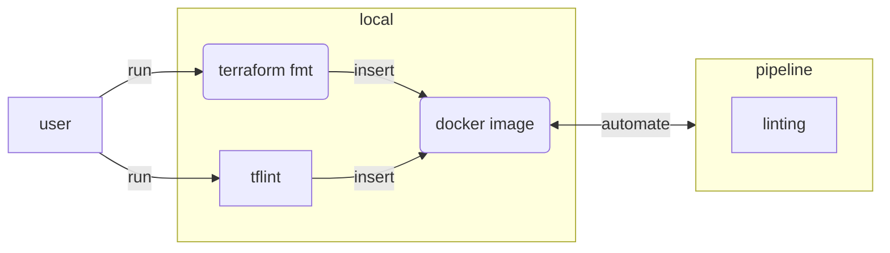

Code quality checks catch mistakes early. For Terraform we can run three levels of linting:

| Tool | What it checks |
| --- | --- |
| `terraform fmt -check` | Canonical formatting (whitespace, indentation) |
| `terraform validate` | Syntactic and semantic validity |
| `tflint` | Provider-specific rules, best practices, unused variables |

In this lab we run these checks locally, package them into a Docker image, push it to Azure
Container Registry, and wire it up as a GitLab CI linting stage.




## Preparation

Navigate to your existing Terraform working directory:

```bash
cd $LAB_ROOT/<folder>
```


## Step {}.1: Run linters locally

Before automating anything, verify the tools work correctly on your local machine. This gives
you fast feedback and lets you understand the output format before you see it in a pipeline log.

`terraform fmt -check` checks formatting without modifying any files — it exits non-zero if any
file is not in canonical form. `terraform validate` checks that all configuration is
syntactically correct and internally consistent. `tflint` goes further and applies
provider-specific rules such as checking that resource types and argument names are valid for
the configured provider version.

```bash
# Check formatting without modifying files
terraform fmt -check

# Validate syntax and provider schemas
terraform validate

# Run provider-specific and best-practice rules
tflint
```

If `terraform fmt -check` exits non-zero, fix the files with:

```bash
terraform fmt
```

Install `tflint` if not already present:

```bash
curl -s https://raw.githubusercontent.com/terraform-linters/tflint/master/install_linux.sh | bash
```


## Step {}.2: Build a linting Docker image

To run the same tools consistently in the pipeline, we package them into a Docker image that
the CI runner can pull. Using an Alpine base keeps the image small. Both Terraform and TFLint
are downloaded as static binaries and installed into `/usr/local/bin` — no package manager
needed for the tools themselves.

The `ARG` instructions allow overriding the versions at build time, making it easy to upgrade
without changing the script logic. A non-root `infra` user is created so the container does
not run as root inside the pipeline.

Create a `Dockerfile` in a new `docker/` subdirectory (or the project root):

```dockerfile
FROM alpine:3.22.1

ARG TERRAFORM_VERSION=v1.12.2
ARG TFLINT_VERSION=v0.58.0

RUN apk --no-cache -U upgrade -a && \
    apk --no-cache add bash ca-certificates curl git grep tree jq figlet unzip yamllint

RUN curl -#L -o terraform.zip \
        "https://releases.hashicorp.com/terraform/${TERRAFORM_VERSION#v}/terraform_${TERRAFORM_VERSION#v}_linux_amd64.zip" && \
    unzip terraform.zip && install -t /usr/local/bin terraform && rm terraform* && \
    curl -#L -o tflint.zip \
        "https://github.com/terraform-linters/tflint/releases/download/${TFLINT_VERSION}/tflint_linux_amd64.zip" && \
    unzip tflint.zip && install -t /usr/local/bin tflint && rm tflint* && \
    addgroup infra && adduser -D -G infra infra

USER infra
```


## Step {}.3: Push the image to Azure Container Registry

Once the image builds locally, push it to the Azure Container Registry (ACR) created in
Chapter 6. The runner will pull it from there at the start of every linting job. Using ACR
keeps the image close to the runner in the same Azure subscription — fast pulls, no external
registry dependency.

```bash
# Authenticate with your registry (name from az acr list)
az acr login -n <your-registry-name>

# Build and push in one step (multi-arch if needed)
docker buildx build --push \
  -t <your-registry-name>.azurecr.io/builder:latest \
  -f Dockerfile .
```

{}
Your self-hosted GitLab Runner must have network access to Azure Container Registry.
If your runner is the VM from Lab 7.3, it is already in the same Azure subscription and can
pull images via `az acr login` or a service principal credential stored as a masked CI variable.
{}


## Step {}.4: Update `.gitlab-ci.yml` with the full pipeline

Now replace the top-level `image:` with your custom builder image and add the `linting` stage
at the front. The builder image contains both `terraform` and `tflint`, so all jobs — including
validate and plan — benefit from the same pinned versions.

The complete updated `.gitlab-ci.yml` (replaces the file from Lab 7.2):

```yaml
---
image: <your-registry-name>.azurecr.io/builder:latest

stages:
  - linting
  - validate
  - plan
  - apply

variables:
  TF_VAR_FILE: "config/dev.tfvars"
  TF_BACKEND_CONFIG: "config/dev_backend.tfvars"
  TF_PLUGIN_CACHE_DIR: "/cache/plugin-cache"
  TF_PLUGIN_CACHE_MAY_BREAK_DEPENDENCY_LOCK_FILE: "1"

before_script:
  - mkdir -p $TF_PLUGIN_CACHE_DIR
  - terraform init -backend-config=$TF_BACKEND_CONFIG

linting:
  stage: linting
  script:
    - find . -name "*.tf" -exec terraform fmt -check {} \+
    - tflint
  tags:
    - acend
    - terraform
    - <your-tag>

validate:
  stage: validate
  script:
    - terraform validate

plan:
  stage: plan
  script:
    - terraform plan -var-file=$TF_VAR_FILE -out=tfplan
  artifacts:
    paths:
      - tfplan
    expire_in: 1 day

apply:
  stage: apply
  script:
    - terraform apply -auto-approve tfplan
  dependencies:
    - plan
  rules:
    - if: $CI_COMMIT_BRANCH == "main"
      when: manual
  environment:
    name: production
```

### Explanation

The `linting` stage runs first and is the only stage that requires the self-hosted tagged
runner (because it needs access to ACR). The `validate`, `plan`, and `apply` jobs can run on
shared runners since the image is already embedded.

The `before_script` is not added to the `linting` job because linting does not need
`terraform init` — no providers are downloaded and no backend is contacted. All other stages
inherit `before_script` automatically.

Swapping the top-level `image:` from `hashicorp/terraform:1.12.2` to the ACR builder image
means the pinned Terraform version is now controlled by the `ARG TERRAFORM_VERSION` in the
`Dockerfile` rather than the image tag — a single place to update when upgrading.


## Step {}.5: Verify in GitLab

Push your changes and open the pipeline in GitLab:

```bash
git add Dockerfile .gitlab-ci.yml
git commit -m "ci: add terraform linting stage"
git push
```

Navigate to **CI/CD → Pipelines** in your project. The pipeline should show a green `linting`
stage followed by `validate` and `plan` stages.

If the linting job fails, read the job log carefully — `terraform fmt -check` prints the file
that needs formatting, and `tflint` prints the rule that was violated with a link to the
documentation explaining why it matters.
