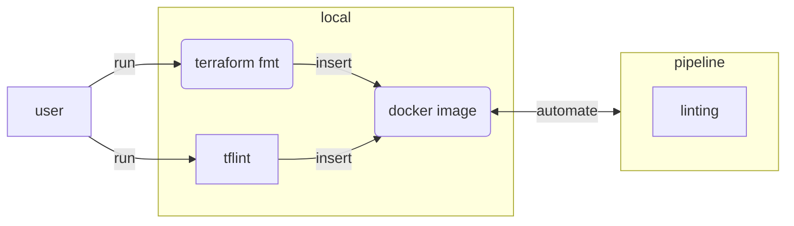

Code quality checks catch mistakes early. For Terraform we can run three levels of linting:

| Tool | What it checks |
| --- | --- |
| `terraform fmt -check` | Canonical formatting (whitespace, indentation) |
| `terraform validate` | Syntactic and semantic validity |
| `tflint` | Provider-specific rules, best practices, unused variables |

In this lab we run these checks locally, package them into a Docker image, push it to Azure
Container Registry, and wire it up as a GitLab CI linting stage.




## Preparation

Navigate to your existing Terraform working directory:

```bash
cd $LAB_ROOT/<folder>
```


## Step {}.1: Run linters locally

Before automating, verify the tools are working locally.

{}
```bash
# Check formatting without modifying files
terraform fmt -check

# Validate syntax and provider schemas
terraform validate

# Run provider-specific and best-practice rules
tflint
```

If `terraform fmt -check` exits non-zero, fix the files with:

```bash
terraform fmt
```

Install `tflint` if not present:

```bash
curl -s https://raw.githubusercontent.com/terraform-linters/tflint/master/install_linux.sh | bash
```
{}

### Explanation

Running the linters locally before committing gives fast feedback, keeps CI green, and
avoids waiting for a full pipeline run to catch a missing space.


## Step {}.2: Build a linting Docker image

Create a `Dockerfile` in a new `docker/` subdirectory (or the project root) that installs
Terraform and TFLint into a minimal Alpine image.

{}
```dockerfile
FROM alpine:3.22.1

ARG TERRAFORM_VERSION=v1.12.2
ARG TFLINT_VERSION=v0.58.0

RUN apk --no-cache -U upgrade -a && \
    apk --no-cache add bash ca-certificates curl git grep tree jq figlet unzip yamllint

RUN curl -#L -o terraform.zip \
        "https://releases.hashicorp.com/terraform/${TERRAFORM_VERSION#v}/terraform_${TERRAFORM_VERSION#v}_linux_amd64.zip" && \
    unzip terraform.zip && install -t /usr/local/bin terraform && rm terraform* && \
    curl -#L -o tflint.zip \
        "https://github.com/terraform-linters/tflint/releases/download/${TFLINT_VERSION}/tflint_linux_amd64.zip" && \
    unzip tflint.zip && install -t /usr/local/bin tflint && rm tflint* && \
    addgroup infra && adduser -D -G infra infra

USER infra
```
{}


## Step {}.3: Push the image to Azure Container Registry

Use the ACR you created in Chapter 6. Tag the image with your registry URL.

{}
```bash
# Authenticate with your registry (name from az acr list)
az acr login -n <your-registry-name>

# Build and push in one step (multi-arch if needed)
docker buildx build --push \
  -t <your-registry-name>.azurecr.io/builder:latest \
  -f Dockerfile .
```
{}

{}
Your self-hosted GitLab Runner must have network access to Azure Container Registry.
If your runner is the VM from Lab 7.2, it is already in the same Azure subscription and can
pull images via `az acr login` or a service principal credential stored as a masked CI variable.
{}


## Step {}.4: Add a linting stage to `.gitlab-ci.yml`

Extend the `.gitlab-ci.yml` created in Lab 7.1 with a new `linting` stage that runs before
`validate` and `plan`.

{}
```yaml
---
image: <your-registry-name>.azurecr.io/builder:latest

stages:
  - linting
  - validate
  - plan
  - apply

variables:
  ARM_TENANT_ID: "c1b34118-6a8f-4348-88c2-b0b1f7350f04"
  TF_PLUGIN_CACHE_MAY_BREAK_DEPENDENCY_LOCK_FILE: "1"
  TF_PLUGIN_CACHE_DIR: "/cache/plugin-cache"

linting:
  stage: linting
  script:
    - find . -name "*.tf" -exec terraform fmt -check {} \+
    - tflint
  tags:
    - acend
    - terraform
    - <your-tag>
```
{}

### Explanation

`find . -name "*.tf" -exec terraform fmt -check {} \+` recursively checks every `.tf` file in
the repository without modifying them. The job fails if any file is not properly formatted,
forcing contributors to run `terraform fmt` before pushing.

Adding the linting stage first means a formatting error fails fast and cheaply — no provider
downloads or Azure API calls are needed.


## Step {}.5: Verify in GitLab

Push your changes and open the pipeline in GitLab:

```bash
git add Dockerfile .gitlab-ci.yml
git commit -m "ci: add terraform linting stage"
git push
```

Navigate to **CI/CD → Pipelines** in your project. The pipeline should show a green `linting`
stage followed by `validate` and `plan` stages.

If the linting job fails, read the job log carefully — `terraform fmt -check` will print the
file that needs formatting, and `tflint` will print the rule that was violated.
