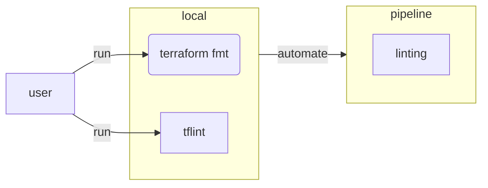

Code quality checks catch mistakes early. For Terraform we can run three levels of linting:

| Tool | What it checks |
| --- | --- |
| `terraform fmt -check` | Canonical formatting (whitespace, indentation) |
| `terraform validate` | Syntactic and semantic validity |
| `tflint` | Provider-specific rules, best practices, unused variables |

In this lab we run these checks locally and wire them up as a GitLab CI linting stage using
the Docker image built and pushed to ACR in Lab 7.4.




## Preparation

Navigate to your existing Terraform working directory:

```bash
cd $LAB_ROOT/<folder>
```


## Step {}.1: Run linters locally

Before automating anything, verify the tools work correctly on your local machine. This gives
you fast feedback and lets you understand the output format before you see it in a pipeline log.

`terraform fmt -check` checks formatting without modifying any files — it exits non-zero if any
file is not in canonical form. `terraform validate` checks that all configuration is
syntactically correct and internally consistent. `tflint` goes further and applies
provider-specific rules such as checking that resource types and argument names are valid for
the configured provider version.

```bash
# Check formatting without modifying files
terraform fmt -check

# Validate syntax and provider schemas
terraform validate

# Run provider-specific and best-practice rules
tflint
```

If `terraform fmt -check` exits non-zero, fix the files with:

```bash
terraform fmt
```

Install `tflint` if not already present:

```bash
curl -s https://raw.githubusercontent.com/terraform-linters/tflint/master/install_linux.sh | bash
```


## Step {}.2: Extend `.gitlab-ci.yml` with the linting stage

The Docker image containing `terraform` and `tflint` was built and pushed to ACR in the
dedicated builder-image repository (Lab 7.4). Now extend the Terraform pipeline's
`.gitlab-ci.yml` to set that image as the default for all jobs and add the `linting`
stage that runs formatting and linting checks before every validate/plan/apply run.

Update `.gitlab-ci.yml` to add `linting` to the stages list and set the top-level `image:`
to the builder image from ACR. The complete updated file — extending the one from Lab 7.2 — is:

```yaml
---
image: ${ACR_REGISTRY_SERVER}/builder:latest

stages:
  - linting
  - validate
  - plan
  - apply

variables:
  TF_VAR_FILE: "config/dev.tfvars"
  TF_BACKEND_CONFIG: "config/dev_backend.tfvars"
  TF_PLUGIN_CACHE_DIR: "/cache/plugin-cache"
  TF_PLUGIN_CACHE_MAY_BREAK_DEPENDENCY_LOCK_FILE: "1"

before_script:
  - mkdir -p $TF_PLUGIN_CACHE_DIR
  - terraform init -backend-config=$TF_BACKEND_CONFIG

linting:
  stage: linting
  script:
    - find . -name "*.tf" -exec terraform fmt -check {} \+
    - tflint
  tags:
    - acend
    - terraform
    - <your-tag>

validate:
  stage: validate
  script:
    - terraform validate

plan:
  stage: plan
  script:
    - terraform plan -var-file=$TF_VAR_FILE -out=tfplan
  artifacts:
    paths:
      - tfplan
    expire_in: 1 day

apply:
  stage: apply
  script:
    - terraform apply -auto-approve tfplan
  dependencies:
    - plan
  rules:
    - if: $CI_COMMIT_BRANCH == "main"
      when: manual
  environment:
    name: production
```

### Explanation

Setting `image: ${ACR_REGISTRY_SERVER}/builder:latest` at the top level means every job that
does not specify its own `image:` uses the custom builder from Lab 7.4. The pinned Terraform
and TFLint versions are therefore controlled by the `ARG` values in the `Dockerfile` rather
than the image tag — a single place to update when upgrading.

The `linting` job does not need `terraform init` because formatting and linting checks work on
the raw HCL source without downloading providers or contacting the backend. GitLab runs
`before_script` for all jobs that do not override it, so the `linting` job would inherit
`terraform init` unnecessarily — add `before_script: []` to the job if you want to skip it
explicitly.

{}
Your self-hosted GitLab Runner must have network access to Azure Container Registry to pull
the builder image. The runner provisioned in Lab 7.3 is already in the same Azure subscription
and authenticates using the `ARM_CLIENT_ID` / `ARM_CLIENT_SECRET` CI variables.

`ACR_REGISTRY_SERVER` must also be added to the **Terraform pipeline project's** CI/CD
variables (same value as in the builder-image project from Lab 7.4).
{}


## Step {}.3: Verify in GitLab

Commit and push the updated pipeline configuration:

```bash
git add .gitlab-ci.yml
git commit -m "ci: add terraform linting stage"
git push
```

Navigate to **CI/CD → Pipelines** in your project. The pipeline should show a green `linting`
stage followed by `validate` and `plan` stages.

If the linting job fails, read the job log carefully — `terraform fmt -check` prints the file
that needs formatting, and `tflint` prints the rule that was violated with a link to the
documentation explaining why it matters.
