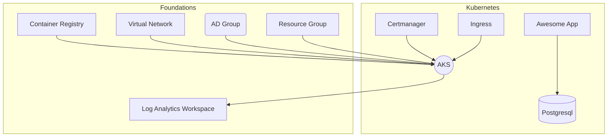

To understand what we are doing we will first have a look on the design we are creating.




## Task {}.1: Initialisation

Again? Yes, but this time we won't save our state locally. We want to save the state in the cloud!
But first, lets create a new folder name `azure` an change into it.

Here we have todo some preparations:

* Login into the Azure Portal
* Create a Ressource Group
* Create a Storage Container

You can do this by clicking in the Portal or via the `az` commandline:

```bash
export NAME="<your-name>" # eg. "ueli"
az login
az group create --location westeurope --name rg-terraform-$NAME
az storage account create --name tfstate$NAME --resource-group rg-terraform-$NAME
az storage container create --resource-group rg-terraform-$NAME --account-name tfstate$NAME --name terraform-state --public-access off
```

Now we can configure Terraform to use this storage account to save the state file remotly. Let's create the config ...

Create a folder called `config` and save the following content to a file named `lab.tfvars` in the `config` directory

```bash
subscription_id      = "<given-by-trainer>"
resource_group_name  = "rg-terraform-<your-name>"
storage_account_name = "tfstate<your-name>"
container_name       = "terraform-state"
key                  = "lab.tfstate"
```

Also save and configure the next lines in the `config` folder in a file namend `lab.tfvars`:

```bash
subscription_id = "<given-by-trainer>"
purpose         = "<your-name>"
environment     = "lab"
location        = "westeurope"
aks = {
  kubernetes_version    = "1.20.7"
  availability_zones    = [1, 2, 3]
  log_retention_in_days = 7
  linux_node_pool = {
    node_count = 2
    vm_size    = "basic_a2"
  }
}
aks_admins_ad_group = "students"
```
